# Passo a Passo: Conectar Supabase ao Power BI

Este guia detalha o processo completo para conectar o Supabase PostgreSQL ao Power BI Desktop, incluindo a resolução do erro de certificado SSL.

## 📋 Visão Geral do Processo

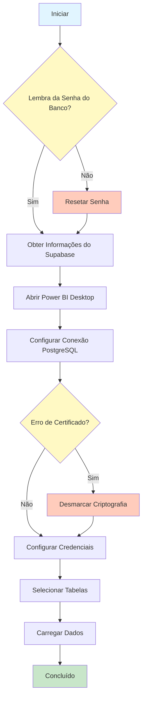

## 🔐 Passo 0: Validar Senha do Banco de Dados

### 0.1 Verificar se Você Lembra da Senha

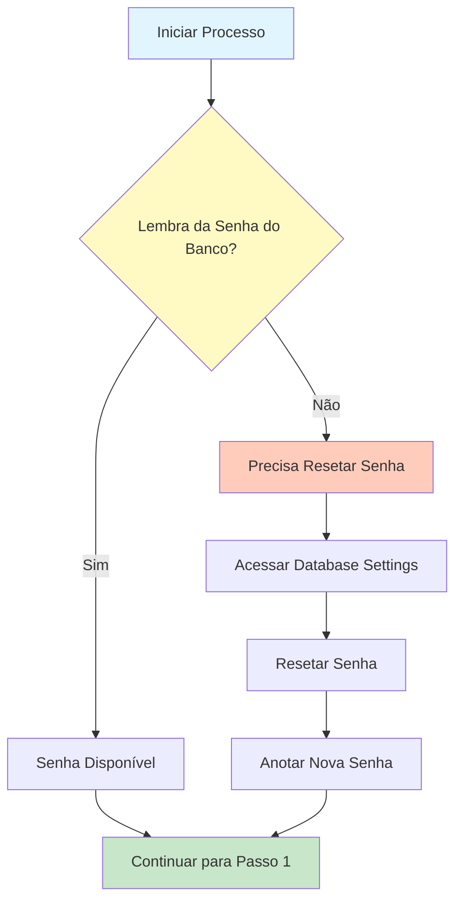

**⚠️ IMPORTANTE:** Antes de começar, certifique-se de que você tem a senha do banco de dados que foi cadastrada quando você registrou o projeto no Supabase.

**Se você NÃO lembra da senha:**

1. Acesse o link abaixo (substitua `[seu-project-ref]` pelo seu project-ref do Supabase):
   ```
   https://supabase.com/dashboard/project/[seu-project-ref]/database/settings
   ```

2. Role até a seção **"Database password"**

3. Clique em **"Reset database password"**

4. Defina uma nova senha e **anote-a em local seguro**

5. Após resetar a senha, continue para o Passo 1

**Se você JÁ tem a senha:**

- Continue diretamente para o Passo 1

## 🔍 Passo 1: Obter Informações de Conexão no Supabase

### 1.1 Acessar o Editor do Supabase

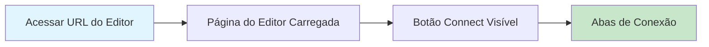

**Ações:**
1. Acesse a URL do editor do seu projeto (substitua `[seu-project-ref]` pelo seu project-ref):
   ```
   https://supabase.com/dashboard/project/[seu-project-ref]/editor/[id]?schema=public&showConnect=true
   ```
   
   **Nota:** Você também pode acessar pelo dashboard:
   - Acesse [Supabase Dashboard](https://app.supabase.com)
   - Selecione seu projeto
   - Navegue até o **SQL Editor** ou **Table Editor**
   - O botão **"Connect"** estará visível no canto superior direito

### 1.2 Obter String de Conexão

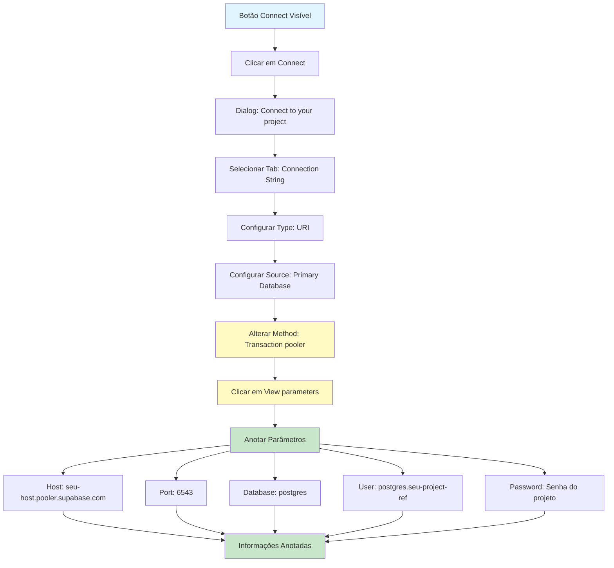

**Passo a passo detalhado:**

1. **Clicar em Connect:**
   - No canto superior direito da página do editor, clique no botão **"Connect"**

2. **Selecionar a aba Connection String:**
   - No dialog que abrir, você verá várias abas no topo
   - Clique na aba **"Connection String"** (primeira aba)

3. **Configurar Type:**
   - No dropdown **"Type"**, selecione **"URI"**

4. **Configurar Source:**
   - No dropdown **"Source"**, selecione **"Primary Database"**

5. **Alterar Method para Transaction pooler:**
   - No dropdown **"Method"**, altere para **"Transaction pooler"**
   - ⚠️ **IMPORTANTE:** Use sempre "Transaction pooler" para melhor performance

6. **Visualizar Parâmetros:**
   - Clique no botão **"View parameters"** para expandir e ver os detalhes da conexão

7. **Anotar as Informações:**
   - Anote os seguintes parâmetros que aparecerão:
     - **Host:** `[seu-host].pooler.supabase.com` (exemplo: `aws-1-us-east-2.pooler.supabase.com`)
     - **Port:** `6543` (Transaction pooler)
     - **Database:** `postgres`
     - **User:** `postgres.[seu-project-ref]` (formato: `postgres.[project-ref]`)
     - **Password:** Use a senha que você validou no Passo 0 (ou resetou se necessário)

**Informações a anotar:**
- ✅ **Host:** `[seu-host].pooler.supabase.com` (exemplo: `aws-1-us-east-2.pooler.supabase.com`)
- ✅ **Porta:** `6543` (Transaction pooler)
- ✅ **Database:** `postgres`
- ✅ **User:** `postgres.[seu-project-ref]` (formato: `postgres.[project-ref]`)
- ✅ **Password:** A senha do banco de dados (validada no Passo 0)


## 💻 Passo 2: Configurar Conexão no Power BI Desktop

### 2.1 Abrir Power BI Desktop e Iniciar Conexão

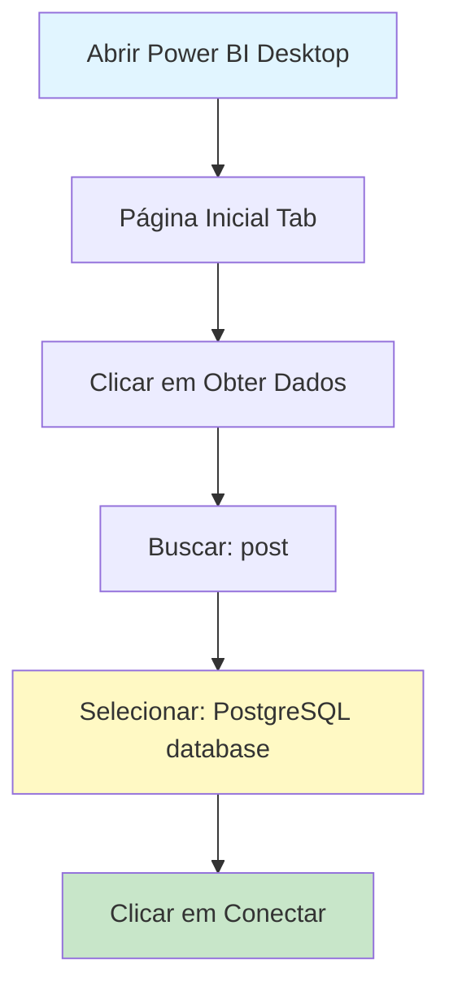

**Ações:**
1. Abra o **Power BI Desktop**
2. Na aba **"Página Inicial"** (Home), clique em **"Obter dados"** (Get Data)
3. Na busca, digite **"post"**
4. Selecione **"PostgreSQL database"**
5. Clique em **"Conectar"** (Connect)

### 2.2 Configurar Servidor e Banco de Dados

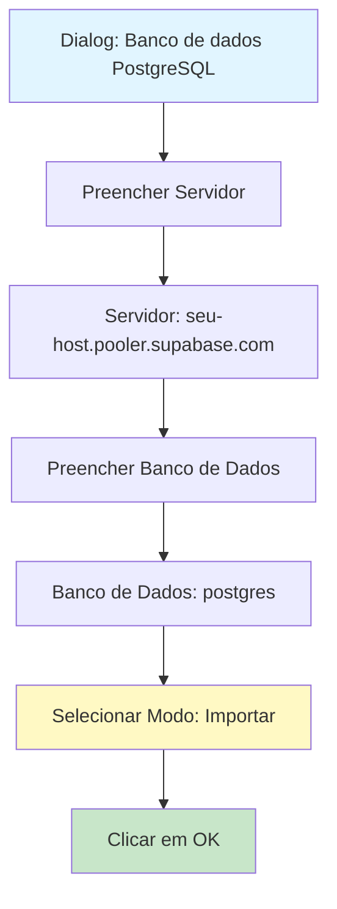

**Configurações:**
- **Servidor:** `[seu-host].pooler.supabase.com` (use o host que você anotou do Supabase)
- **Banco de Dados:** `postgres`
- **Modo de Conectividade de Dados:** Selecione **"Importar"** (Import)
  - ⚠️ **Importante:** Use "Importar" para melhor performance, não "DirectQuery"

### 2.3 Configurar Credenciais

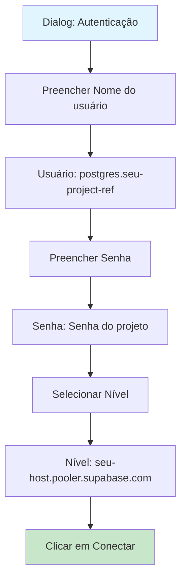

**Configurações:**
- **Nome do usuário:** `postgres.[seu-project-ref]` (use o user que você anotou do Supabase)
- **Senha:** Digite a senha do banco de dados
- **Selecione o nível:** Deixe o servidor selecionado (ex: `[seu-host].pooler.supabase.com`)

## ⚠️ Passo 3: Resolver Erro de Certificado SSL

### 3.1 Identificar o Erro

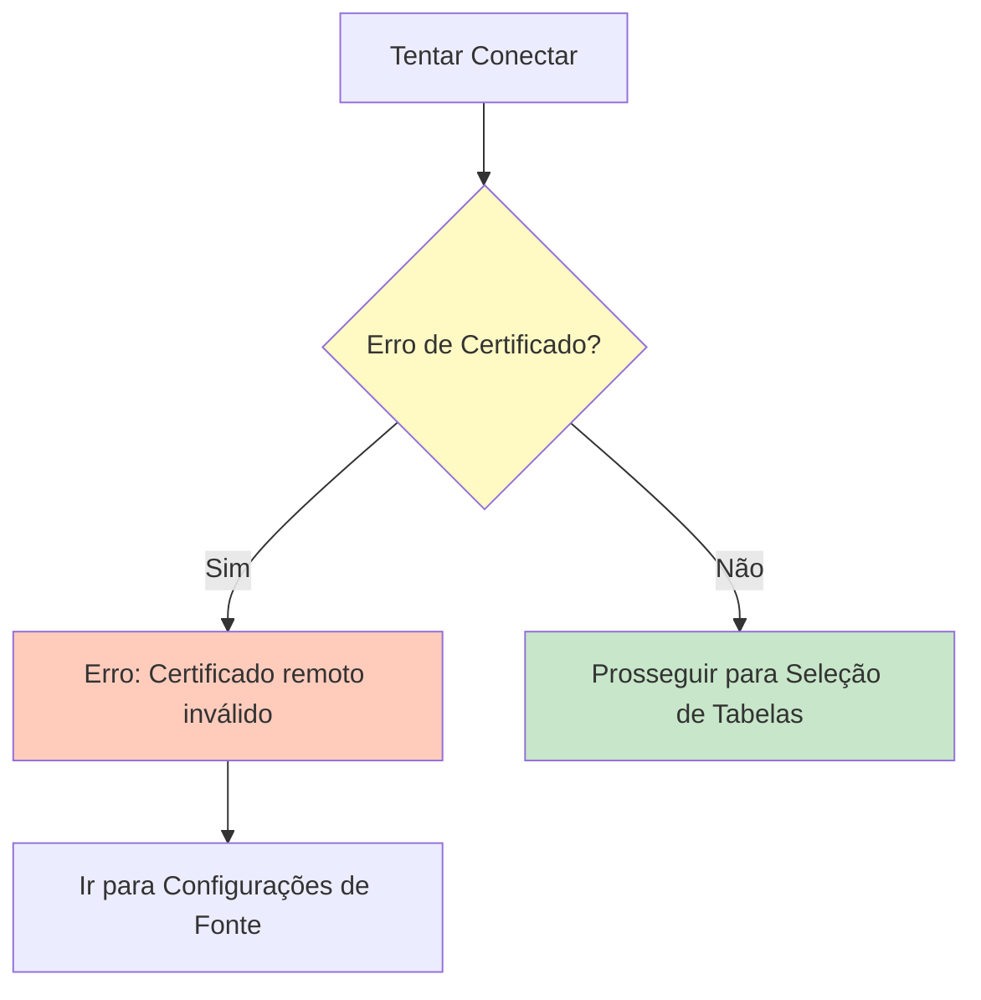

**Erro esperado:**
```
Não é possível estabelecer conexão
Encontramos um erro ao tentar conectar.
Detalhes: 'O certificado remoto é inválido, de acordo com o procedimento de validação.'
```

### 3.2 Acessar Configurações de Fonte de Dados

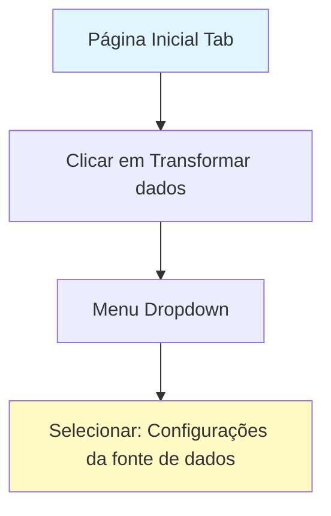

**Ações:**
1. Na aba **"Página Inicial"** (Home)
2. Clique em **"Transformar dados"** (Transform data) - botão com ícone de tabela e lápis
3. No menu dropdown, selecione **"Configurações da fonte de dados"** (Data source settings)

### 3.3 Editar Permissões

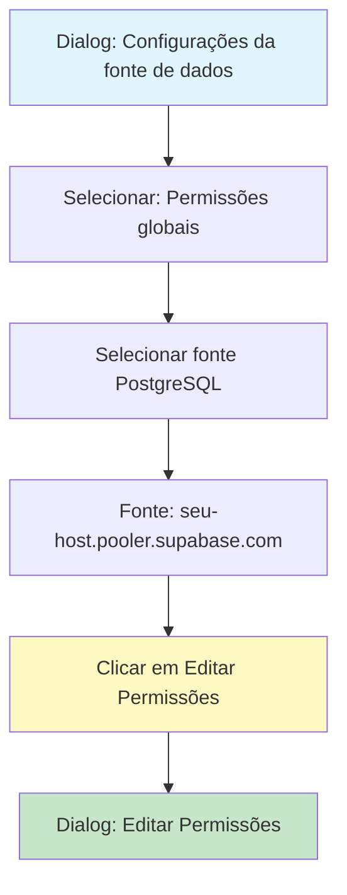

**Ações:**
1. No dialog **"Configurações da fonte de dados"**
2. Selecione o radio button **"Permissões globais"** (Global permissions)
3. Na lista, selecione sua fonte PostgreSQL (ex: `[seu-host].pooler.supabase.com`)
4. Clique em **"Editar Permissões..."** (Edit Permissions...)

### 3.4 Desmarcar Criptografia

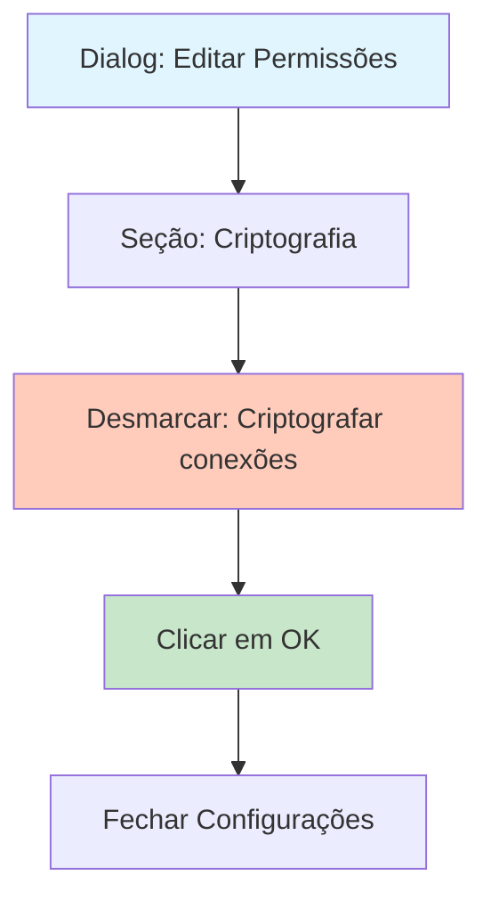

**Ações:**
1. No dialog **"Editar Permissões"**
2. Na seção **"Criptografia"** (Encryption)
3. **DESMARQUE** a opção **"Criptografar conexões"** (Encrypt connections)
   - ⚠️ **IMPORTANTE:** Esta é a solução para o erro de certificado SSL
4. Clique em **"OK"**
5. Feche o dialog de configurações

### 3.5 Tentar Conectar Novamente

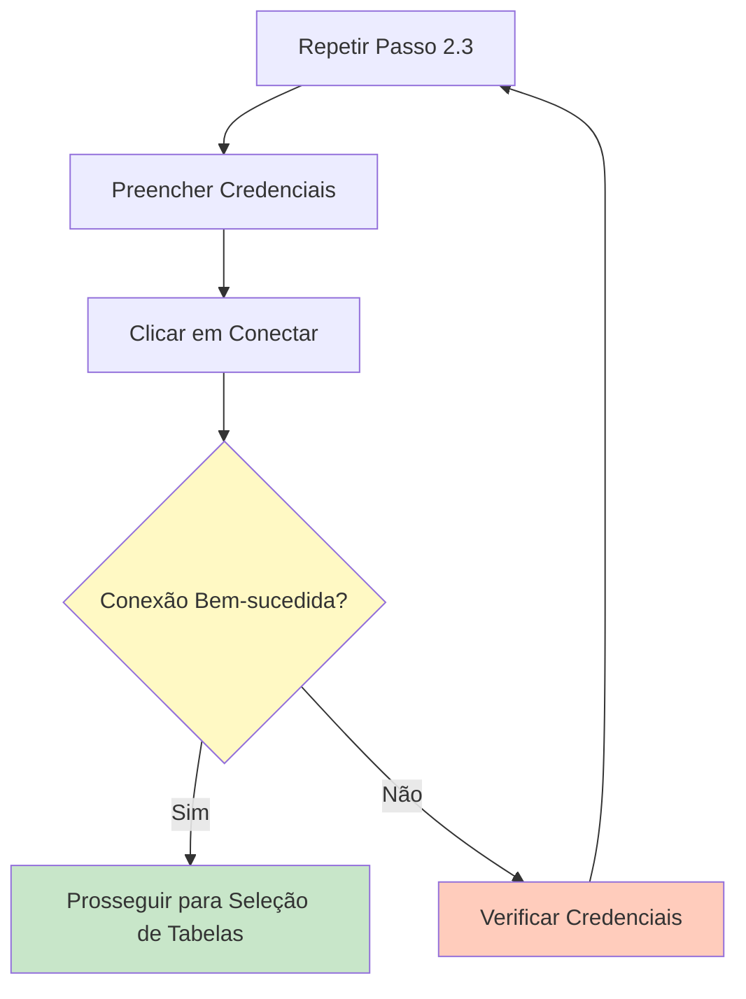

**Ações:**
1. Repita o **Passo 2.3** (Configurar Credenciais)
2. Preencha usuário e senha novamente
3. Clique em **"Conectar"**
4. Se ainda houver erro, verifique:
   - Credenciais corretas
   - Host correto
   - Senha resetada (se necessário)

## 📊 Passo 4: Selecionar e Carregar Tabelas

### 4.1 Navegador de Dados

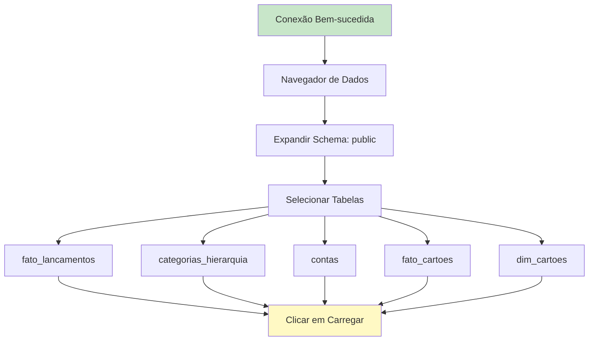

**Tabelas Recomendadas:**
- ✅ `fato_lancamentos` - Tabela fato principal
- ✅ `categorias_hierarquia` - Dimensão de categorias
- ✅ `contas` - Dimensão de contas
- ✅ `fato_cartoes` - Tabela fato de cartões (se existir)
- ✅ `dim_cartoes` - Dimensão de cartões (se existir)

### 4.2 Carregar Dados

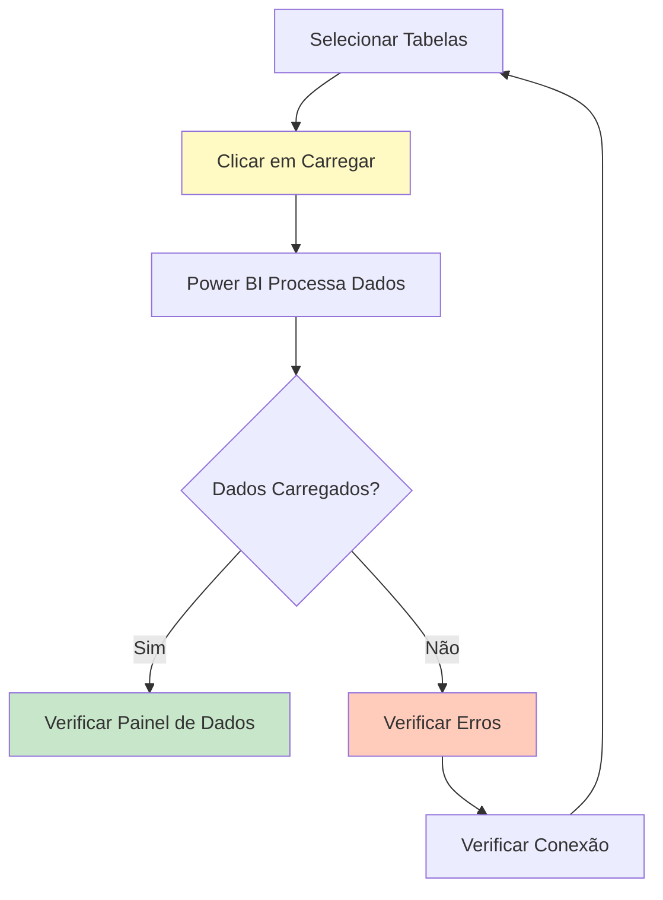

**Ações:**
1. Marque as tabelas que deseja importar
2. Clique em **"Carregar"** (Load) ou **"Transformar dados"** (Transform data) se precisar fazer transformações
3. Aguarde o Power BI processar e carregar os dados
4. Verifique o painel **"Dados"** (Data) à direita para confirmar que as tabelas foram carregadas

## ✅ Resumo do Processo Completo

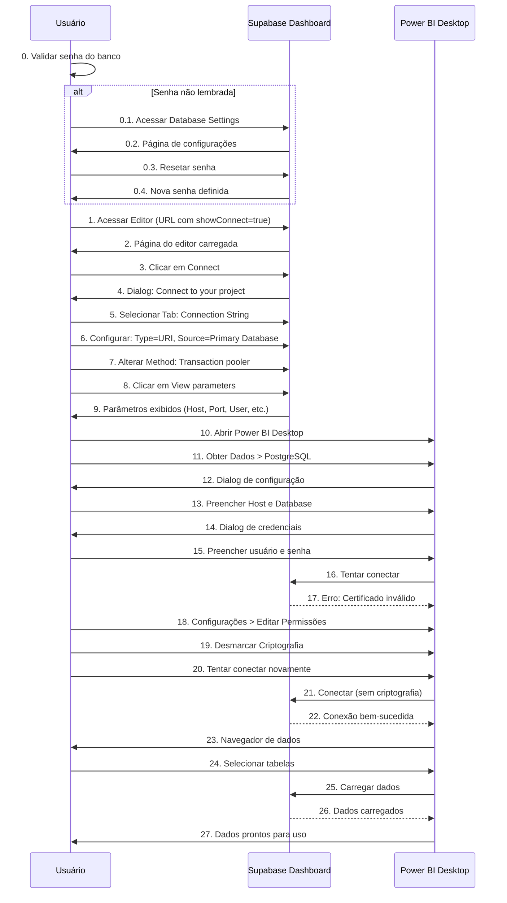

## 📝 Checklist de Configuração

Use este checklist para garantir que todos os passos foram seguidos:

### Validação Inicial
- [ ] Senha do banco validada (lembrada ou resetada)
- [ ] URL do editor acessada
- [ ] Botão Connect localizado

### Informações do Supabase
- [ ] Tab "Connection String" selecionada
- [ ] Type configurado: URI
- [ ] Source configurado: Primary Database
- [ ] Method alterado: Transaction pooler
- [ ] View parameters clicado
- [ ] Host anotado (ex: `[seu-host].pooler.supabase.com`)
- [ ] Porta anotada (`6543` para pooler)
- [ ] Database anotado (`postgres`)
- [ ] Usuário anotado (ex: `postgres.[seu-project-ref]`)
- [ ] Senha confirmada

### Configuração no Power BI
- [ ] Power BI Desktop aberto
- [ ] Conexão PostgreSQL iniciada
- [ ] Servidor configurado corretamente
- [ ] Database configurado (`postgres`)
- [ ] Modo selecionado: **Importar**
- [ ] Credenciais preenchidas
- [ ] Criptografia **DESMARCADA** (se houver erro)
- [ ] Conexão bem-sucedida
- [ ] Tabelas selecionadas
- [ ] Dados carregados

## 🔧 Troubleshooting

### Erro: "Certificado remoto inválido"

**Solução:**
1. Vá em **Transformar dados** > **Configurações da fonte de dados**
2. Selecione **Permissões globais**
3. Selecione sua fonte PostgreSQL
4. Clique em **Editar Permissões**
5. **DESMARQUE** "Criptografar conexões"
6. Clique em **OK**
7. Tente conectar novamente

### Erro: "Falha na autenticação"

**Soluções:**
1. Verifique se o usuário está no formato correto: `postgres.[project-ref]`
2. Verifique se a senha está correta
3. Se necessário, resete a senha em:
   ```
   https://supabase.com/dashboard/project/[seu-project-ref]/database/settings
   ```

### Erro: "Não é possível conectar ao servidor"

**Soluções:**
1. Verifique se o host está correto
2. Verifique sua conexão com a internet
3. Tente usar o Connection Pooler (porta 6543) em vez da Session mode (porta 5432)
4. Verifique se não há firewall bloqueando a conexão

## 📚 Referências

- [Documentação Supabase - Connection Pooling](https://supabase.com/docs/guides/database/connecting-to-postgres#connection-pooler)
- [Documentação Power BI - PostgreSQL](https://learn.microsoft.com/en-us/power-bi/connect-data/desktop-connect-to-postgresql-database)
- [Supabase Dashboard - Database Settings](https://supabase.com/dashboard/project/[seu-project-ref]/database/settings)

## ⚠️ Notas Importantes

1. **Criptografia Desmarcada:** Desmarcar "Criptografar conexões" resolve o erro de certificado SSL, mas reduz a segurança da conexão. Para produção, considere usar Power BI Gateway.

2. **Modo Importar vs DirectQuery:**
   - **Importar:** Melhor performance, dados são copiados para o Power BI
   - **DirectQuery:** Dados sempre atualizados, mas consultas mais lentas

3. **Connection Pooler:** Use sempre o Connection Pooler (porta 6543) para melhor performance e gerenciamento de conexões.

4. **Senha:** A senha do banco é a mesma que você definiu ao criar o projeto no Supabase. Se não lembrar, use o link de reset.

---

**Última atualização:** Guia genérico para conexão Supabase + Power BI

**Nota sobre URLs:**
- URL do Editor: `https://supabase.com/dashboard/project/[seu-project-ref]/editor/[id]?schema=public&showConnect=true`
- URL para Reset de Senha: `https://supabase.com/dashboard/project/[seu-project-ref]/database/settings`

