# Passo a Passo: Conectar Supabase ao Power BI via API REST

Este guia detalha o processo completo para conectar o Supabase ao Power BI Desktop usando a API REST, incluindo paginação automática para grandes volumes de dados.

## 📋 Visão Geral do Processo

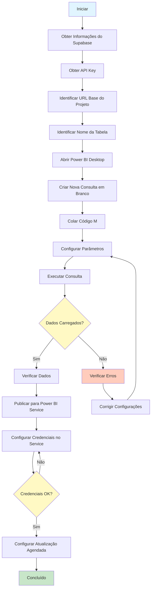

## 🔍 Passo 1: Obter Informações de Conexão no Supabase

### 1.1 Acessar o Dashboard do Supabase

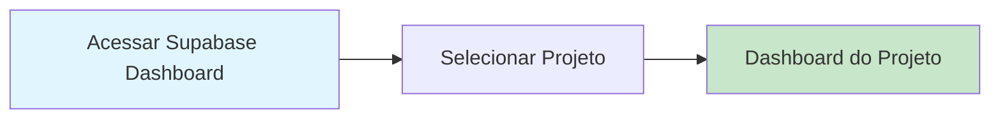

**Ações:**
1. Acesse [Supabase Dashboard](https://app.supabase.com)
2. Faça login na sua conta
3. Selecione o projeto que deseja conectar

### 1.2 Obter URL Base do Projeto

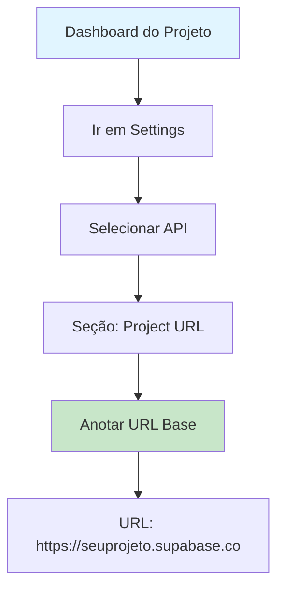

**Ações:**
1. No menu lateral esquerdo, clique em **"Settings"** (Configurações)
2. Selecione a aba **"API"**
3. Na seção **"Project URL"**, você encontrará a URL base do seu projeto
4. **Anote esta URL** - ela será usada como `BaseUrl` no código M
   - Formato: `https://[seu-project-ref].supabase.co`
   - Exemplo: `https://abcdefghijklmnop.supabase.co`

### 1.3 Obter API Key

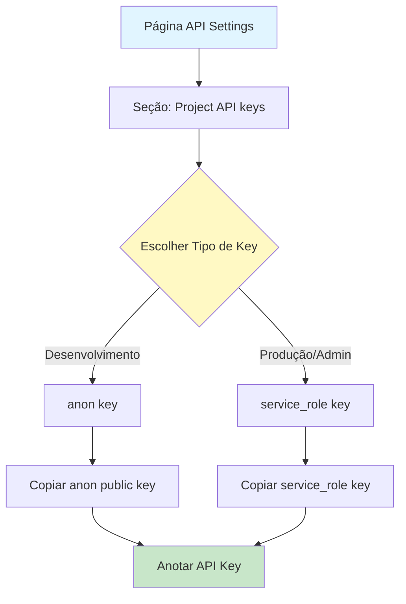

**Ações:**
1. Na mesma página de **API Settings**, role até a seção **"Project API keys"**
2. Você verá duas chaves disponíveis:
   - **`anon` `public`**: Chave pública para uso em aplicações frontend
   - **`service_role` `secret`**: Chave privada com acesso total (use com cuidado)

3. **Escolha a chave apropriada:**
   - **Para desenvolvimento/testes:** Use a `anon` `public` key
   - **Para produção/admin:** Use a `service_role` key (mais poderosa, mas requer segurança)

4. **Copie a chave** clicando no ícone de copiar ao lado da chave
5. **Anote esta chave** - ela será usada como `ApiKey` no código M

**⚠️ IMPORTANTE:**
- A `anon` key tem permissões limitadas baseadas nas políticas RLS (Row Level Security)
- A `service_role` key ignora RLS e tem acesso total - use apenas em ambientes seguros
- Nunca exponha a `service_role` key em código frontend ou repositórios públicos

### 1.4 Identificar Nome da Tabela

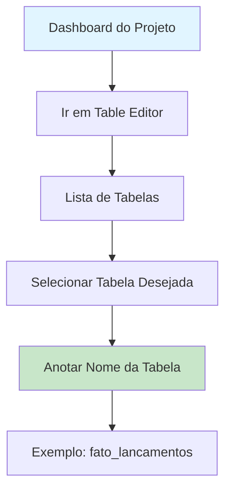

**Ações:**
1. No menu lateral esquerdo, clique em **"Table Editor"** ou **"Database"** > **"Tables"**
2. Você verá uma lista de todas as tabelas do seu projeto
3. **Selecione a tabela** que deseja conectar ao Power BI
4. **Anote o nome exato da tabela** - ele será usado no `RPath` do código M
   - O caminho completo será: `rest/v1/[nome_da_tabela]`
   - Exemplo: Se a tabela é `fato_lancamentos`, o caminho será `rest/v1/fato_lancamentos`

### 1.4.1 Identificar Schema da Tabela

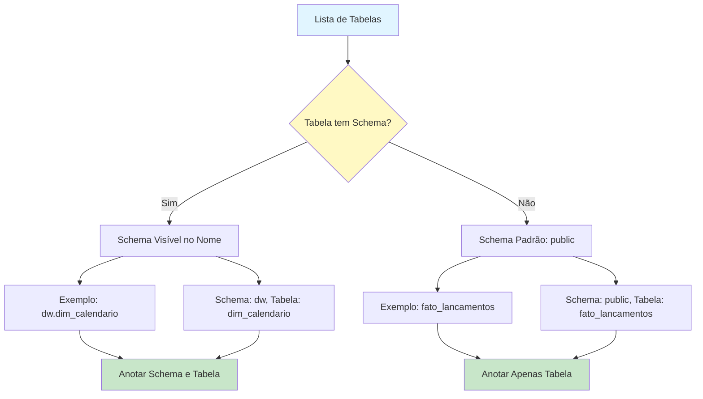

**Informações Importantes:**

1. **Schemas no PostgreSQL/Supabase:**
   - Um **schema** é um namespace que organiza objetos do banco de dados (tabelas, views, funções, etc.)
   - O schema padrão é `public` - quando não especificado, assume-se que a tabela está em `public`
   - Tabelas podem estar em schemas diferentes, como `dw`, `analytics`, `staging`, etc.

2. **Como Identificar o Schema:**
   - No **Table Editor** do Supabase, o nome completo da tabela pode aparecer como `schema.tabela`
   - Exemplo: `dw.dim_calendario` significa:
     - **Schema:** `dw`
     - **Tabela:** `dim_calendario`
   - Se você ver apenas `fato_lancamentos` (sem schema), significa que está no schema `public`

3. **Exemplos de Nomes de Tabelas:**
   - `fato_lancamentos` → Schema: `public`, Tabela: `fato_lancamentos`
   - `dw.dim_calendario` → Schema: `dw`, Tabela: `dim_calendario`
   - `analytics.vendas` → Schema: `analytics`, Tabela: `vendas`
   - `public.contas` → Schema: `public`, Tabela: `contas` (explícito)

4. **Quando Especificar o Schema:**
   - Se a tabela está no schema `public` (padrão), você pode omitir o schema
   - Se a tabela está em outro schema (como `dw`, `analytics`, etc.), você **DEVE** incluir o schema no `RPath`
   - Formato no `RPath`: `rest/v1/[schema].[tabela]`
   - Exemplo: Para `dw.dim_calendario`, use `rest/v1/dw.dim_calendario`

**⚠️ IMPORTANTE:**
- Se você tentar acessar uma tabela de schema diferente sem especificar o schema, receberá erro "404 Not Found"
- Sempre verifique o schema da tabela antes de configurar o `RPath` no código M
- **CRÍTICO:** Antes de usar tabelas de schemas diferentes, você DEVE expor o schema no Supabase (veja seção 1.4.2)
- Para mais informações sobre como configurar o código M com schemas, consulte a seção **2.3 Colar e Configurar o Código M**

### 1.4.2 Expor Schema no Supabase (OBRIGATÓRIO para Schemas Diferentes)

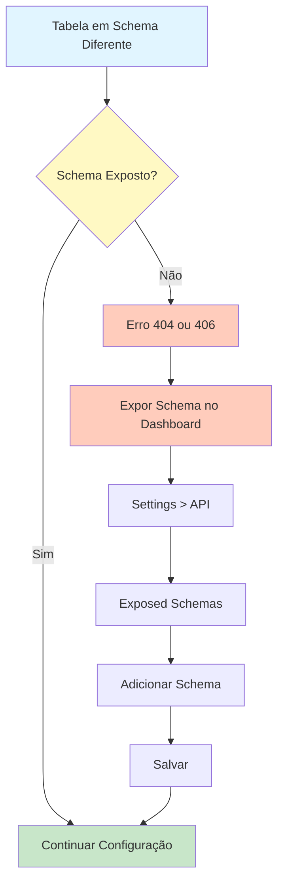

**⚠️ PASSO CRÍTICO - NÃO PULE ESTE PASSO:**

Se sua tabela está em um schema diferente de `public` (como `dw`, `analytics`, `staging`, etc.), você **DEVE** expor o schema no painel do Supabase antes de tentar acessá-lo via API REST.

**Passos para Expor o Schema:**

1. **Acesse o Dashboard do Supabase:**
   - Faça login em [Supabase Dashboard](https://app.supabase.com)
   - Selecione o projeto onde está a tabela

2. **Navegue até as Configurações da API:**
   - No menu lateral esquerdo, clique em **"Settings"** (Configurações) - ícone de engrenagem ⚙️
   - Clique na aba **"API"**

3. **Localize a Seção "Exposed Schemas":**
   - Role a página até encontrar a seção **"API Settings"** ou **"Exposed Schemas"**
   - Você verá uma lista de schemas expostos
   - Por padrão, apenas `public` está exposto

4. **Adicione o Schema Desejado:**
   - Clique para editar a lista de schemas expostos
   - Adicione o nome do schema (ex: `dw`, `analytics`, `staging`)
   - A lista ficará algo como: `public, dw` (separados por vírgula)
   - ⚠️ **Importante:** Use apenas o nome do schema, sem aspas ou espaços extras

5. **Salve as Alterações:**
   - Clique em **"Save"** (Salvar) para aplicar as mudanças
   - Aguarde alguns segundos para que as alterações sejam aplicadas

**Exemplo Visual:**
```
Exposed Schemas: [public, dw]
                 ↑        ↑
              padrão   adicionado
```

**⚠️ IMPORTANTE:**
- Sem expor o schema, você receberá erros **404 (Not Found)** ou **406 (Not Acceptable)**
- Este passo é **OBRIGATÓRIO** antes de tentar acessar tabelas em schemas diferentes
- Você precisa ter permissões de administrador no projeto para alterar essas configurações
- Após expor o schema, pode levar alguns segundos para as mudanças entrarem em vigor

**Verificação:**
Após expor o schema, você pode testar se está funcionando acessando a URL diretamente no navegador:
```
https://[seu-projeto].supabase.co/rest/v1/[tabela]?apikey=[sua-key]
```
Com o header `Accept-Profile: [schema]` (use uma extensão do navegador como ModHeader para adicionar headers)

### 1.4.3 Conceder Permissões SQL ao Schema (OBRIGATÓRIO)

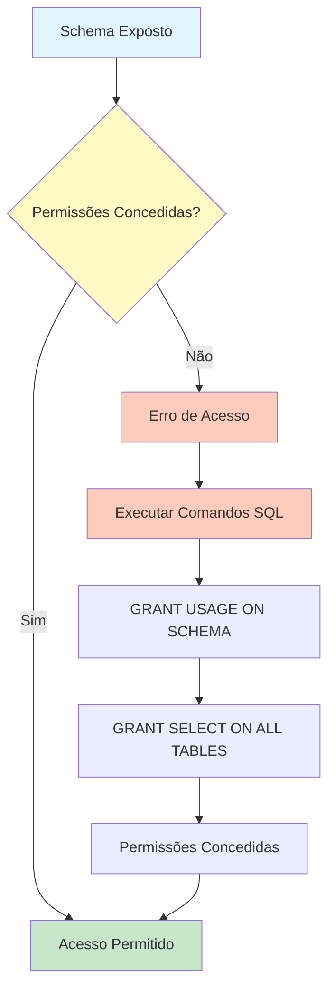

**⚠️ PASSO CRÍTICO - CONCEDER PERMISSÕES:**

Após expor o schema, você **DEVE** conceder permissões SQL para que os papéis `anon` e `authenticated` possam acessar as tabelas do schema via API REST.

**Passos para Conceder Permissões:**

1. **Acesse o SQL Editor do Supabase:**
   - No Dashboard do Supabase, clique em **"SQL Editor"** no menu lateral
   - Ou acesse diretamente: [SQL Editor](https://app.supabase.com/project/[seu-projeto]/sql)

2. **Execute os Comandos SQL:**

   **Opção A: Conceder Permissões para Todo o Schema (Recomendado)**
   
   Use este comando para conceder acesso a **todas as tabelas** do schema de uma vez:
   
   ```sql
   -- Concede permissão de uso do schema
   GRANT USAGE ON SCHEMA dw TO anon, authenticated;
   
   -- Concede permissão de SELECT em todas as tabelas do schema
   GRANT SELECT ON ALL TABLES IN SCHEMA dw TO anon, authenticated;
   
   -- Concede permissão de SELECT em tabelas futuras (opcional, mas recomendado)
   ALTER DEFAULT PRIVILEGES IN SCHEMA dw 
   GRANT SELECT ON TABLES TO anon, authenticated;
   ```
   
   **Substitua `dw` pelo nome do seu schema** (ex: `analytics`, `staging`, etc.)
   
   **Opção B: Conceder Permissões para uma Tabela Específica**
   
   Se você quiser conceder permissões apenas para uma tabela específica:
   
   ```sql
   -- Concede permissão de uso do schema
   GRANT USAGE ON SCHEMA dw TO anon, authenticated;
   
   -- Concede permissão de SELECT apenas nesta tabela
   GRANT SELECT ON dw.dim_calendario TO anon, authenticated;
   ```
   
   **Substitua `dw.dim_calendario` pelo schema e nome da sua tabela**

3. **Execute os Comandos:**
   - Cole os comandos SQL no editor
   - Clique em **"Run"** (Executar) ou pressione `Ctrl+Enter`
   - Aguarde a confirmação de sucesso

4. **Verifique se Funcionou:**
   - Você deve ver uma mensagem de sucesso
   - Tente acessar a tabela via API REST novamente
   - Se ainda houver erro, verifique se executou todos os comandos corretamente

**Explicação dos Comandos:**

- `GRANT USAGE ON SCHEMA`: Permite que os papéis usem o schema (necessário para acessar objetos dentro dele)
- `GRANT SELECT ON ALL TABLES IN SCHEMA`: Concede permissão de leitura em todas as tabelas existentes do schema
- `ALTER DEFAULT PRIVILEGES`: Garante que tabelas criadas no futuro também terão essas permissões (opcional, mas recomendado)

**⚠️ IMPORTANTE:**
- Sem essas permissões, você receberá erros de acesso mesmo após expor o schema
- Use a **Opção A** se você quer acesso a todas as tabelas do schema
- Use a **Opção B** se você quer acesso apenas a tabelas específicas
- Essas permissões são necessárias para que a API REST funcione corretamente
- Você precisa ter permissões de administrador no projeto para executar esses comandos

**Exemplo Completo para Schema `dw`:**

```sql
-- Concede permissões para todo o schema dw
GRANT USAGE ON SCHEMA dw TO anon, authenticated;
GRANT SELECT ON ALL TABLES IN SCHEMA dw TO anon, authenticated;
ALTER DEFAULT PRIVILEGES IN SCHEMA dw 
GRANT SELECT ON TABLES TO anon, authenticated;
```

Após executar esses comandos, todas as tabelas do schema `dw` estarão acessíveis via API REST usando as chaves `anon` ou `authenticated`.

### 1.5 Entender Limites de PageSize

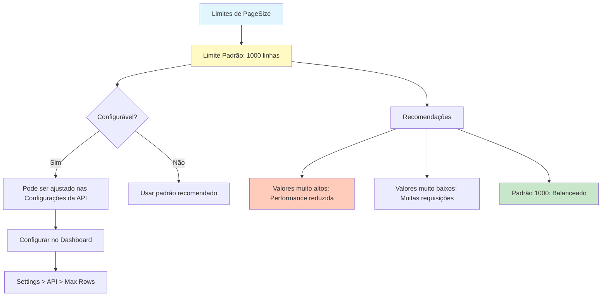

**Informações Importantes:**

1. **Limite Padrão:**
   - O Supabase retorna **máximo de 1.000 linhas por requisição** por padrão
   - Este é o limite padrão configurado em todos os projetos Supabase
   - O código M fornecido usa este valor como padrão (`PageSize = 1000`)

2. **Configuração:**
   - Este limite **pode ser configurado** nas configurações da API do seu projeto
   - Acesse: **Settings** > **API** > **Max Rows** (ou configurações similares)
   - ⚠️ **Nota:** Alterar este valor pode afetar a performance da API

3. **Limite Máximo Absoluto:**
   - Não há um limite máximo absoluto documentado oficialmente
   - Valores muito altos podem resultar em:
     - Tempos de resposta mais longos
     - Maior uso de recursos do servidor
     - Possíveis timeouts em requisições grandes

4. **Recomendações:**
   - **Para desenvolvimento/testes:** Use o padrão de 1000 linhas
   - **Para produção:** Mantenha 1000 ou reduza para 500-750 se houver problemas de performance
   - **Para grandes volumes:** Use paginação (já implementada no código M) em vez de aumentar o limite
   - **Para dados pequenos:** Você pode reduzir para 100-250 para requisições mais rápidas

5. **Como Configurar no Supabase Dashboard:**
   - Acesse o Dashboard do seu projeto
   - Vá em **Settings** > **API**
   - Procure por configurações relacionadas a **"Max Rows"** ou **"Page Size Limit"**
   - ⚠️ **Atenção:** Alterações aqui afetam todas as requisições da API do projeto

**Nota sobre o Código M:**
- O código M fornecido já implementa paginação automática
- Mesmo com o limite de 1000 linhas, o código busca todas as páginas automaticamente
- Você pode ajustar o `PageSize` no código M conforme necessário, mas recomenda-se manter 1000 ou menos

## 💻 Passo 2: Configurar Conexão no Power BI Desktop

### 2.1 Abrir Power BI Desktop e Criar Nova Consulta

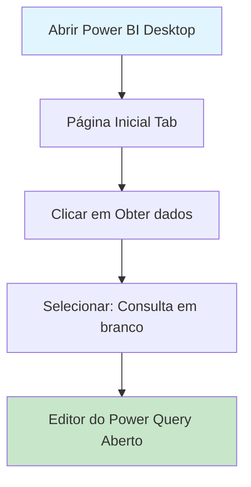

**Ações:**
1. Abra o **Power BI Desktop**
2. Na aba **"Página Inicial"** (Home), clique em **"Obter dados"** (Get Data)
3. No menu dropdown, selecione **"Consulta em branco"** (Blank Query)
4. O **Editor do Power Query** será aberto automaticamente

### 2.2 Acessar Editor Avançado

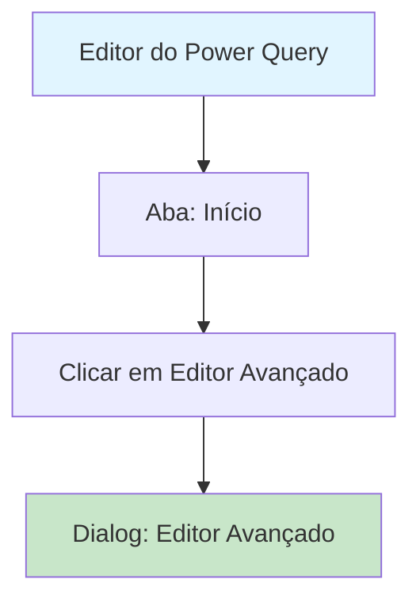

**Ações:**
1. No **Editor do Power Query**, certifique-se de estar na aba **"Início"** (Home)
2. No grupo **"Consulta"** (Query), clique em **"Editor Avançado"** (Advanced Editor)
3. Um dialog será aberto com um editor de texto para código M

### 2.3 Colar e Configurar o Código M

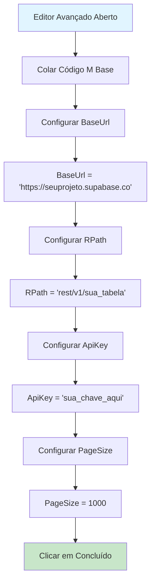

**Ações:**
1. **Cole o código M completo** no editor (veja o código completo abaixo)
2. **Configure os parâmetros** substituindo os valores:

   **a) BaseUrl:**
   ```m
   BaseUrl = "https://seuprojeto.supabase.co",
   ```
   - Substitua `seuprojeto` pela URL base que você anotou no Passo 1.2
   - Exemplo: `BaseUrl = "https://abcdefghijklmnop.supabase.co",`

   **b) RPath:**
   ```m
   RPath = "rest/v1/sua_tabela",
   ```
   - Substitua `sua_tabela` pelo nome da tabela que você anotou no Passo 1.4
   - **Para tabelas no schema `public` (padrão):**
     - Exemplo: `RPath = "rest/v1/fato_lancamentos",`
   - **Para tabelas em schemas diferentes:**
     - Inclua o schema no formato `[schema].[tabela]`
     - Exemplo: Para `dw.dim_calendario`, use `RPath = "rest/v1/dw.dim_calendario",`
     - ⚠️ **IMPORTANTE:** Se a tabela está em schema diferente de `public`, você DEVE incluir o schema no `RPath`
   - Para mais informações sobre schemas, consulte a seção **1.4.1 Identificar Schema da Tabela**

   **c) ApiKey:**
   ```m
   ApiKey = "sua_chave_aqui",
   ```
   - Substitua `sua_chave_aqui` pela API key que você copiou no Passo 1.3
   - Exemplo: `ApiKey = "eyJhbGciOiJIUzI1NiIsInR5cCI6IkpXVCJ9...",`

   **d) PageSize:**
   ```m
   PageSize = 1000,
   ```
   - Este é o número de linhas por requisição
   - **Limite padrão do Supabase:** 1000 linhas por requisição (veja detalhes na seção 1.5)
   - ⚠️ **Recomendação:** Mantenha 1000 ou menos para melhor performance
   - Valores muito altos podem causar timeouts ou lentidão
   - Você pode reduzir para 500-750 se houver problemas de performance
   - Para mais informações sobre limites, consulte a seção **1.5 Entender Limites de PageSize**

3. Clique em **"Concluído"** (Done)

**Código M Completo:**

```m
let
    // --- 1. CONFIGURAÇÕES INICIAIS ---
    // Coloque apenas a raiz do seu projeto aqui
    BaseUrl = "https://seuprojeto.supabase.co", 
    
    // Coloque o caminho rest/v1/nome_da_sua_tabela (sem a barra inicial)
    RPath = "rest/v1/sua_tabela", 
    
    // Sua chave anon ou service_role
    ApiKey = "sua_chave_aqui", 
    
    // Limite de linhas por requisição (padrão Supabase é 1000)
    PageSize = 1000, 

    // --- 2. FUNÇÃO QUE BUSCA UMA PÁGINA ---
    GetPage = (offset as number) =>
        let
            Response = Web.Contents(
                BaseUrl,
                [
                    RelativePath = RPath,
                    Headers = [
                        #"apikey" = ApiKey,
                        #"Authorization" = "Bearer " & ApiKey
                    ],
                    // A Query string controla a paginação
                    Query = [
                        select = "*",
                        limit = Text.From(PageSize),
                        offset = Text.From(offset)
                    ]
                ]
            ),
            Json = Json.Document(Response)
        in
            Json,

    // --- 3. LOOP DE PAGINAÇÃO (List.Generate) ---
    // Esta função gera uma lista de listas até que a API retorne vazio
    Source = List.Generate(
        () => [Offset = 0, Data = GetPage(0)], // Estado inicial
        each not List.IsEmpty([Data]),         // Condição de continuação (enquanto vier dados)
        each [
            Offset = [Offset] + PageSize, 
            Data = GetPage([Offset] + PageSize)
        ], // Próximo passo (incrementa o offset)
        each [Data] // O que extrair de cada passo
    ),

    // --- 4. TRATAMENTO E EXPANSÃO DOS DADOS ---
    // Converte a lista de páginas em uma tabela
    #"Tabela de Paginas" = Table.FromList(Source, Splitter.SplitByNothing(), null, null, ExtraValues.Error),
    
    // Expande a lista dentro de cada linha (Junta todas as páginas)
    #"Expandir Paginas" = Table.ExpandListColumn(#"Tabela de Paginas", "Column1"),
    
    // Identifica as colunas dinamicamente baseada no primeiro registro
    Colunas = if Table.IsEmpty(#"Expandir Paginas") then {} else Record.FieldNames(#"Expandir Paginas"{0}[Column1]),
    
    // Expande os registros finais para colunas normais
    #"Dados Finais" = Table.ExpandRecordColumn(#"Expandir Paginas", "Column1", Colunas)
in
    #"Dados Finais"
```

## 🔐 Passo 3: Configurar Credenciais de Autenticação

### 3.1 Configurar Credenciais da Web

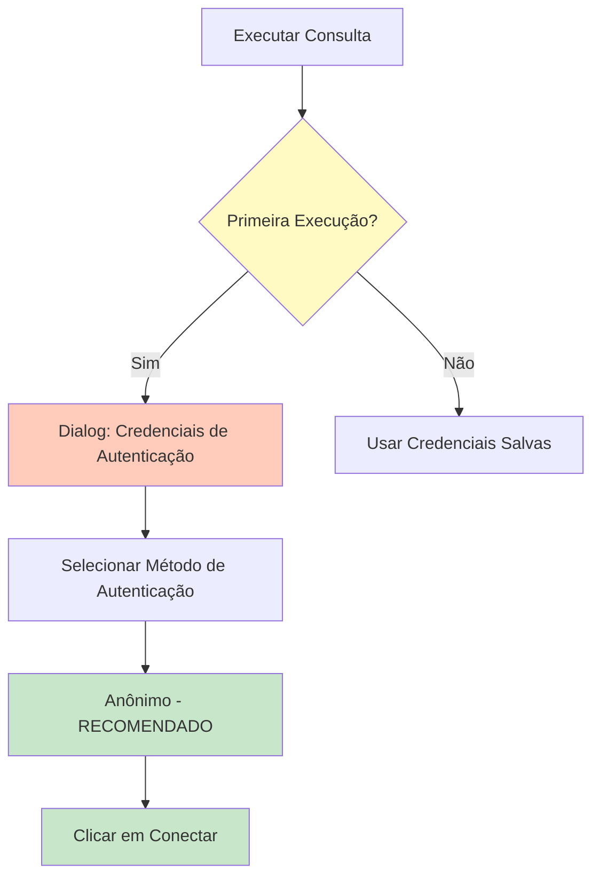

**Ações:**
1. Após clicar em **"Concluído"**, o Power BI tentará executar a consulta
2. Se for a primeira vez, um dialog **"Credenciais de Autenticação"** aparecerá
3. **Selecione o método de autenticação apropriado** (veja opções abaixo)
4. Clique em **"Conectar"** (Connect)

#### Opções de Método de Autenticação

O Power BI oferece várias opções de autenticação para fontes de dados web. Para conexão com Supabase via API REST, use a seguinte configuração:

| Método | Quando Usar | Configuração para Supabase |
|-------|-------------|---------------------------|
| **Anônimo** (Anonymous) | ✅ **RECOMENDADO** - Para APIs REST com autenticação via headers | Use este método. A autenticação real é feita via headers (`apikey` e `Authorization`) no código M |
| OAuth2 | Para APIs que requerem autenticação OAuth2 | Não aplicável para Supabase REST API padrão |
| Chave (Key) | Para APIs que requerem chave de API no cabeçalho | Não necessário - a chave já está no código M |
| Windows | Para recursos que usam autenticação Windows | Não aplicável |
| Básico (Basic) | Para APIs que usam HTTP Basic Auth | Não aplicável para Supabase |

**⚠️ IMPORTANTE para Supabase:**
- **SEMPRE selecione "Anônimo" (Anonymous)** no dialog de credenciais
- A autenticação real acontece através dos headers HTTP no código M:
  - `apikey`: Sua API key do Supabase
  - `Authorization`: Bearer token com sua API key
- O Power BI não precisa autenticar na URL base, apenas fazer requisições HTTP

### 3.2 Configurar Níveis de Privacidade

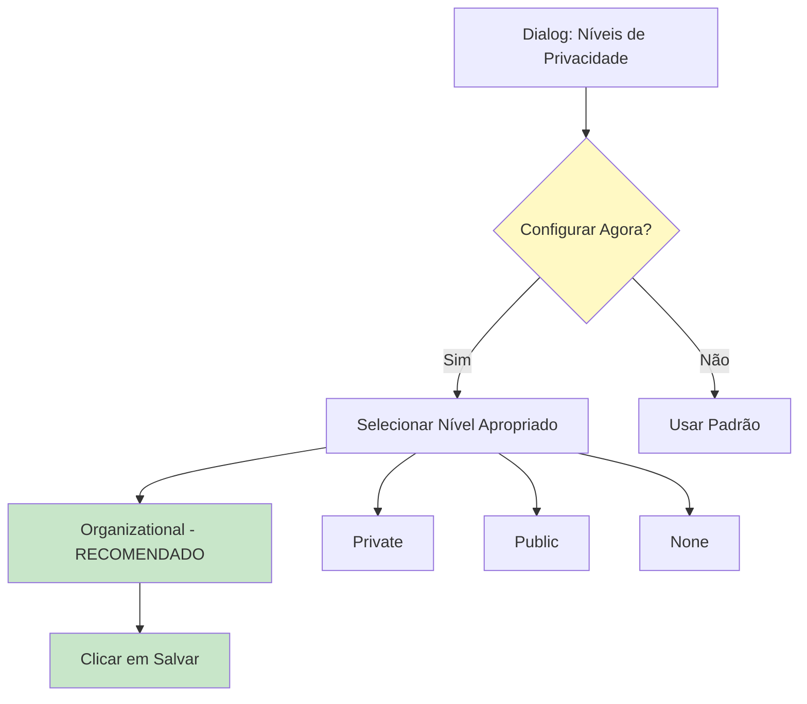

**Ações:**
1. Se aparecer um dialog sobre **"Níveis de Privacidade"** (Privacy Levels):
   - Selecione o nível apropriado (veja opções abaixo)
   - Clique em **"Salvar"** (Save)
2. Se não aparecer, o Power BI usará o padrão configurado

#### Opções de Nível de Privacidade

O Power BI oferece diferentes níveis de privacidade para controlar como os dados são compartilhados entre fontes:

| Nível | Descrição | Quando Usar | Recomendação para Supabase |
|-------|-----------|-------------|---------------------------|
| **Organizational** (Organizacional) | ✅ **RECOMENDADO** - Dados podem ser compartilhados dentro da organização | Para uso corporativo e compartilhamento seguro | Use este nível para ambientes corporativos |
| Private (Privado) | Dados não podem ser combinados com outras fontes | Para dados sensíveis que não devem ser mesclados | Use apenas se necessário isolamento total |
| Public (Público) | Dados podem ser combinados livremente | Para dados públicos ou não sensíveis | Não recomendado para dados do Supabase |
| None (Nenhum) | Sem restrições de privacidade | Raramente usado | Não recomendado |

**⚠️ IMPORTANTE para Supabase:**
- **Recomenda-se usar "Organizational"** para a maioria dos casos
- Este nível permite que o Power BI combine dados de diferentes fontes dentro da organização
- Mantém segurança adequada para dados corporativos
- É o nível padrão recomendado para ambientes empresariais

## 📊 Passo 4: Executar e Validar a Consulta

### 4.1 Executar a Consulta

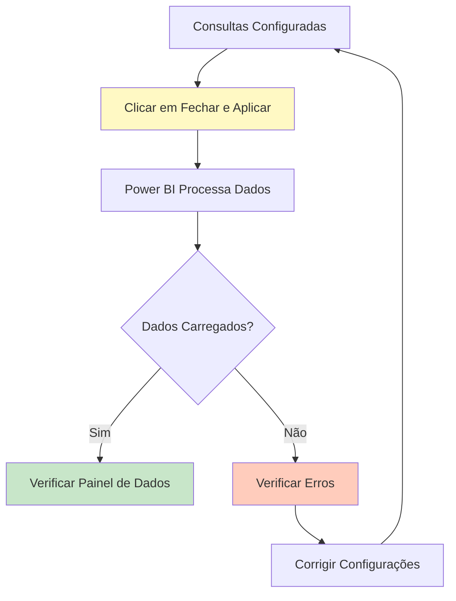

**Ações:**
1. No **Editor do Power Query**, verifique se a consulta está configurada corretamente
2. Clique em **"Fechar e Aplicar"** (Close & Apply) no canto superior esquerdo
3. O Power BI começará a processar a consulta e buscar os dados da API
4. Aguarde o processamento completar

### 4.2 Verificar Dados Carregados

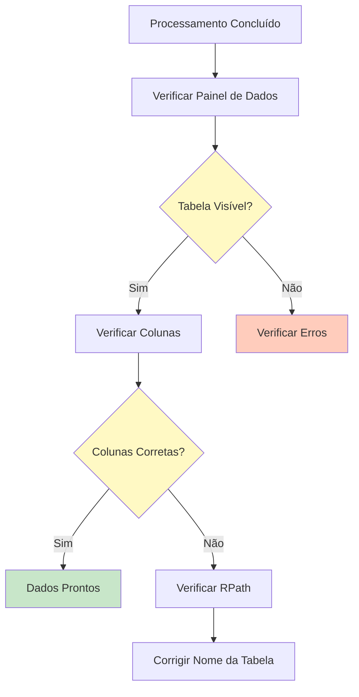

**Ações:**
1. Após o processamento, verifique o painel **"Dados"** (Data) à direita
2. Você deve ver uma tabela com o nome da sua consulta (ou "Query1" se não renomeou)
3. **Verifique:**
   - ✅ A tabela está visível
   - ✅ As colunas estão corretas
   - ✅ Os dados foram carregados
   - ✅ A quantidade de linhas está correta (se você conhece o total esperado)

## 🌐 Passo 5: Configurar no Power BI Service (Online)

Após criar e testar sua conexão no Power BI Desktop, você precisará configurar as credenciais no Power BI Service (online) para que os relatórios possam ser atualizados automaticamente e compartilhados com outros usuários.

### 5.1 Publicar Relatório do Desktop para o Service

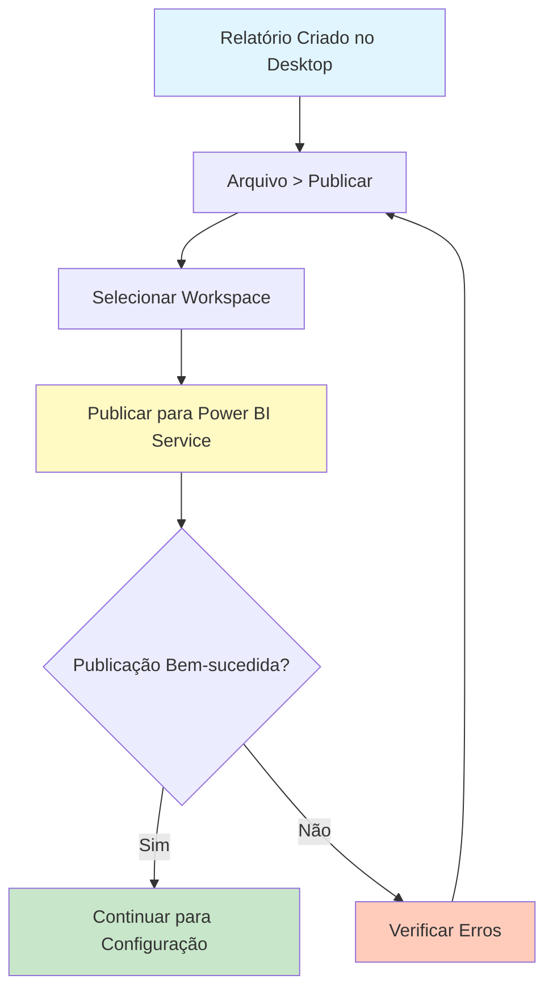

**Ações:**
1. No **Power BI Desktop**, certifique-se de que seu relatório está salvo e funcionando corretamente
2. No menu superior, clique em **"Arquivo"** (File) > **"Publicar"** (Publish) > **"Publicar no Power BI"** (Publish to Power BI)
3. Se não estiver logado, faça login com sua conta do Power BI
4. Selecione o **workspace** onde deseja publicar o relatório
   - Exemplo: Seu workspace pessoal ou um workspace compartilhado da organização
5. Clique em **"Selecionar"** (Select) para iniciar a publicação
6. Aguarde a publicação ser concluída
7. Uma mensagem de sucesso aparecerá quando a publicação estiver completa

### 5.2 Acessar Configurações do Modelo Semântico

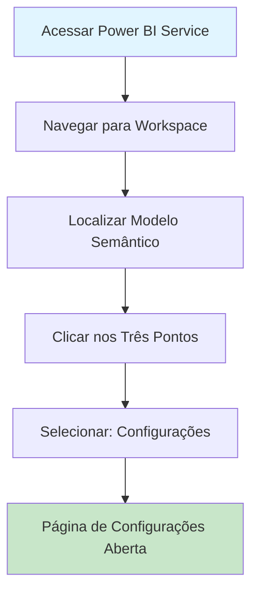

**Ações:**
1. Acesse [Power BI Service](https://app.powerbi.com) no navegador
2. Faça login com sua conta do Power BI
3. No menu lateral esquerdo, clique em **"Workspaces"** (Áreas de Trabalho)
4. Selecione o workspace onde você publicou o relatório
5. Na lista de itens do workspace, localize o **modelo semântico** (semantic model) correspondente ao seu relatório
   - O modelo semântico geralmente tem o mesmo nome do arquivo `.pbix` que você publicou
   - Exemplo: Se você publicou `meu_relatorio.pbix`, procure por `meu_relatorio` na lista
6. Clique nos **três pontos** (⋯) ao lado do modelo semântico
7. No menu que aparecer, selecione **"Configurações"** (Settings)

### 5.3 Acessar Credenciais da Fonte de Dados

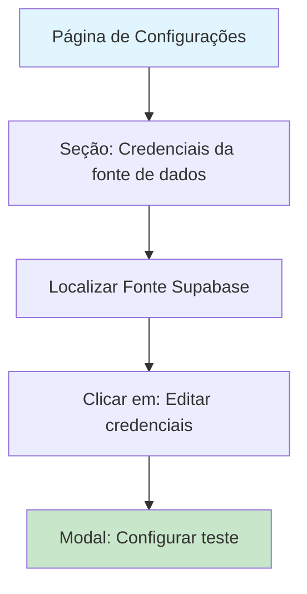

**Ações:**
1. Na página de **Configurações** do modelo semântico, role até a seção **"Credenciais da fonte de dados"** (Data source credentials)
2. Você verá uma lista de todas as fontes de dados usadas no modelo
3. Localize a fonte correspondente ao Supabase
   - Geralmente aparecerá como a URL base do seu projeto (ex: `https://seuprojeto.supabase.co`)
4. Clique em **"Editar credenciais"** (Edit credentials) ao lado da fonte Supabase
5. Um modal **"Configurar teste"** (Configure test) será aberto

### 5.4 Configurar Teste de Conexão

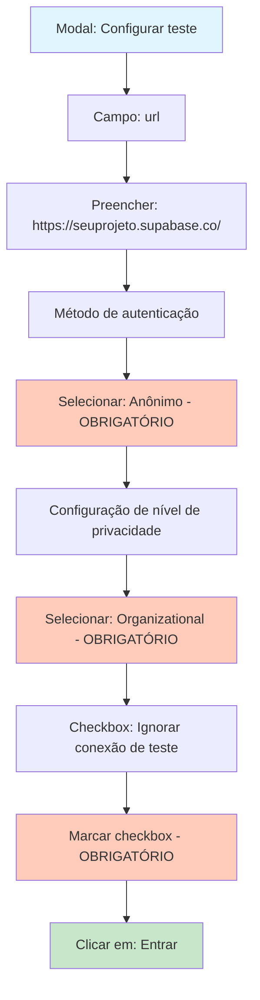

**⚠️ CONFIGURAÇÕES OBRIGATÓRIAS:**

No modal **"Configurar teste"**, configure os seguintes campos:

1. **Campo "url":**
   - Preencha com a URL base do seu projeto Supabase
   - Formato: `https://[seu-project-ref].supabase.co/`
   - ⚠️ **Importante:** Inclua a barra final (`/`) na URL
   - Exemplo: `https://seuprojeto.supabase.co/`

2. **Método de autenticação:**
   - **SELECIONE: "Anônimo" (Anonymous)** ⚠️ **OBRIGATÓRIO**
   - Esta é a única opção que funciona corretamente com a API REST do Supabase
   - A autenticação real acontece via headers no código M (não via método de autenticação do Power BI)

3. **Configuração de nível de privacidade para esta fonte de dados:**
   - **SELECIONE: "Organizational" (Organizacional)** ⚠️ **OBRIGATÓRIO**
   - Este nível permite que o Power BI combine dados de diferentes fontes dentro da organização
   - Mantém segurança adequada para dados corporativos
   - É o nível recomendado para ambientes empresariais

4. **Checkbox "Ignorar conexão de teste":**
   - **MARQUE esta opção** ⚠️ **OBRIGATÓRIO**
   - Esta opção faz com que o Power BI não tente validar a conexão na URL base
   - Como a autenticação acontece via headers no código M, o teste de conexão na URL base falharia
   - Marcar esta opção permite que o Power BI use as credenciais sem tentar validar na URL base

5. **Clicar em "Entrar" (Sign in):**
   - Após configurar todos os campos acima, clique no botão **"Entrar"** (verde)
   - O Power BI salvará as credenciais configuradas

**Por que essas configurações são necessárias:**

- **Anônimo:** A API REST do Supabase usa autenticação via headers HTTP (`apikey` e `Authorization`), não via autenticação HTTP tradicional. O método "Anônimo" permite que o Power BI faça requisições HTTP sem tentar autenticar na URL base.

- **Organizational:** Este nível de privacidade é o padrão recomendado para ambientes corporativos, permitindo que o Power BI combine dados de diferentes fontes dentro da organização de forma segura.

- **Ignorar conexão de teste:** Como a autenticação acontece via headers no código M (não na URL base), o teste de conexão na URL base falharia. Marcar esta opção permite que o Power BI use as credenciais sem tentar validar na URL base, confiando na autenticação via headers implementada no código M.

### 5.5 Configurar Atualização Agendada (Opcional)

```mermaid
flowchart TD
    A[Página de Configurações] --> B[Seção: Atualizar]
    B --> C[Ativar: Manter dados atualizados]
    C --> D[Configurar Frequência]
    D --> E[Configurar Horário]
    E --> F[Salvar Configurações]
    
    style A fill:#e1f5ff
    style F fill:#c8e6c9
```

**Ações:**
1. Na mesma página de **Configurações** do modelo semântico, role até a seção **"Atualizar"** (Refresh)
2. Ative a opção **"Manter dados atualizados"** (Keep data updated)
3. Configure a **frequência** de atualização:
   - Diária: Atualiza uma vez por dia
   - Várias vezes ao dia: Configure múltiplos horários
   - Semanal: Atualiza em dias específicos da semana
4. Configure o **horário** de atualização (se aplicável)
5. Clique em **"Aplicar"** (Apply) para salvar as configurações

**⚠️ Notas sobre Atualização Agendada:**
- A atualização agendada requer que as credenciais estejam configuradas corretamente (Passo 5.4)
- O Power BI Service precisa ter acesso à internet para fazer as requisições à API do Supabase
- Para grandes volumes de dados, considere atualizar durante horários de menor uso
- Verifique os limites de atualização do seu plano do Power BI

## 🔄 Passo 6: Criar Múltiplas Consultas (Opcional)

### 5.1 Duplicar Consulta para Outras Tabelas

```mermaid
flowchart TD
    A[Consulta Original Criada] --> B[Clicar com Botão Direito]
    B --> C[Selecionar: Duplicar]
    C --> D[Nova Consulta Criada]
    D --> E[Renomear Consulta]
    E --> F[Abrir Editor Avançado]
    F --> G[Alterar RPath]
    G --> H[Executar Nova Consulta]
    
    style A fill:#e1f5ff
    style H fill:#c8e6c9
```

**Ações:**
1. No painel de **"Consultas"** (Queries) à esquerda do Editor do Power Query
2. Clique com o botão direito na consulta que você criou
3. Selecione **"Duplicar"** (Duplicate)
4. Renomeie a nova consulta para o nome da nova tabela
5. Abra o **Editor Avançado** da nova consulta
6. Altere apenas o `RPath` para a nova tabela:
   ```m
   RPath = "rest/v1/nova_tabela",
   ```
7. Clique em **"Concluído"** e execute

**Tabelas Recomendadas:**
- ✅ `fato_lancamentos` - Tabela fato principal
- ✅ `categorias_hierarquia` - Dimensão de categorias
- ✅ `contas` - Dimensão de contas
- ✅ `fato_cartoes` - Tabela fato de cartões (se existir)
- ✅ `dim_cartoes` - Dimensão de cartões (se existir)

## ✅ Resumo do Processo Completo

```mermaid
sequenceDiagram
    participant U as Usuário
    participant S as Supabase Dashboard
    participant PBI as Power BI Desktop
    
    U->>S: 1. Acessar Dashboard
    S->>U: 2. Página do projeto
    U->>S: 3. Settings > API
    S->>U: 4. Project URL e API Keys exibidas
    U->>S: 5. Table Editor
    S->>U: 6. Lista de tabelas
    U->>PBI: 7. Abrir Power BI Desktop
    U->>PBI: 8. Obter dados > Consulta em branco
    PBI->>U: 9. Editor do Power Query
    U->>PBI: 10. Editor Avançado
    U->>PBI: 11. Colar código M
    U->>PBI: 12. Configurar BaseUrl, RPath, ApiKey
    U->>PBI: 13. Concluído
    PBI->>U: 14. Dialog: Credenciais
    U->>PBI: 15. Selecionar Anônimo
    PBI->>S: 16. Requisição GET com headers
    S-->>PBI: 17. Resposta JSON (primeira página)
    PBI->>S: 18. Requisições adicionais (paginação)
    S-->>PBI: 19. Todas as páginas retornadas
    PBI->>U: 20. Dados processados e carregados
    U->>PBI: 21. Fechar e Aplicar
    PBI->>U: 22. Dados prontos para uso
    U->>PBI: 23. Publicar para Power BI Service
    PBI->>U: 24. Relatório publicado
    U->>PBI: 25. Configurar credenciais no Service
    PBI->>U: 26. Credenciais configuradas (Anônimo, Organizational, Ignorar teste)
    PBI->>U: 27. Atualização agendada configurada (opcional)
```

## 📝 Checklist de Configuração

Use este checklist para garantir que todos os passos foram seguidos:

### Informações do Supabase
- [ ] Dashboard do Supabase acessado
- [ ] Projeto selecionado
- [ ] Settings > API acessado
- [ ] Project URL anotada (formato: `https://[projeto].supabase.co`)
- [ ] API Key copiada (`anon` ou `service_role`)
- [ ] Table Editor acessado
- [ ] Nome da tabela anotado
- [ ] Schema da tabela identificado (se diferente de `public`)
- [ ] **Se schema diferente de `public`:** Schema exposto em Settings > API > Exposed Schemas ⚠️ OBRIGATÓRIO
- [ ] **Se schema diferente de `public`:** Permissões SQL concedidas no SQL Editor ⚠️ OBRIGATÓRIO
  - [ ] `GRANT USAGE ON SCHEMA` executado
  - [ ] `GRANT SELECT ON ALL TABLES IN SCHEMA` executado (ou para tabela específica)
- [ ] RPath configurado corretamente (incluindo schema se necessário ou usando header Accept-Profile)

### Configuração no Power BI
- [ ] Power BI Desktop aberto
- [ ] Consulta em branco criada
- [ ] Editor Avançado aberto
- [ ] Código M colado
- [ ] `BaseUrl` configurado corretamente
- [ ] `RPath` configurado corretamente:
  - Para schema `public`: `rest/v1/[tabela]`
  - Para outros schemas: `rest/v1/[schema].[tabela]`
- [ ] `ApiKey` configurado
- [ ] `PageSize` configurado (padrão: 1000)
- [ ] Credenciais configuradas (Anônimo)
- [ ] Consulta executada com sucesso
- [ ] Dados carregados e verificados

### Validação Final
- [ ] Tabela visível no painel de Dados
- [ ] Colunas corretas exibidas
- [ ] Quantidade de linhas correta
- [ ] Dados atualizados

### Configuração no Power BI Service (Online)
- [ ] Relatório publicado do Desktop para o Service
- [ ] Workspace selecionado corretamente
- [ ] Configurações do modelo semântico acessadas
- [ ] Credenciais da fonte de dados acessadas
- [ ] Modal "Configurar teste" aberto
- [ ] Campo "url" preenchido corretamente (com barra final)
- [ ] Método de autenticação configurado: **Anônimo** ⚠️ OBRIGATÓRIO
- [ ] Nível de privacidade configurado: **Organizational** ⚠️ OBRIGATÓRIO
- [ ] Checkbox "Ignorar conexão de teste" **MARCADO** ⚠️ OBRIGATÓRIO
- [ ] Credenciais salvas com sucesso
- [ ] Atualização agendada configurada (opcional)
- [ ] Teste de atualização manual realizado (opcional)

## 🔧 Troubleshooting

### Erro: "Não é possível conectar ao servidor"

**Soluções:**
1. Verifique se o `BaseUrl` está correto (sem barra no final)
2. Verifique sua conexão com a internet
3. Verifique se o projeto Supabase está ativo
4. Tente acessar a URL manualmente no navegador:
   ```
   https://[seu-projeto].supabase.co/rest/v1/[sua-tabela]?apikey=[sua-key]
   ```

### Erro: "Falha na autenticação" ou "401 Unauthorized"

**Soluções:**
1. Verifique se a `ApiKey` está correta e completa
2. Verifique se está usando a chave correta (`anon` ou `service_role`)
3. Se usar `anon` key, verifique as políticas RLS (Row Level Security) da tabela
4. Tente usar `service_role` key temporariamente para testar (não recomendado para produção)

### Erro: "404 Not Found" ou "Tabela não encontrada"

**Soluções (em ordem de prioridade):**

1. **⚠️ PRIMEIRO: Verifique se o schema foi exposto no Supabase:**
   - Se a tabela está em schema diferente de `public`, você **DEVE** expor o schema primeiro
   - Acesse: **Settings** > **API** > **Exposed Schemas**
   - Adicione o schema à lista (ex: `dw`, `analytics`, etc.)
   - Clique em **Save**
   - ⚠️ **Este é o passo mais comum que causa erro 404!**
   - Para instruções detalhadas, consulte a seção **1.4.2 Expor Schema no Supabase**

2. Verifique se o `RPath` está correto:
   - **Para tabelas no schema `public` (padrão):** Formato: `rest/v1/[nome_da_tabela]`
   - **Para tabelas em schemas diferentes:** Use uma das abordagens:
     - Abordagem 1: Formato `rest/v1/[schema].[tabela]` (ex: `rest/v1/dw.dim_calendario`)
     - Abordagem 2: Formato `rest/v1/[tabela]` + header `Accept-Profile: [schema]`
   - Sem barra inicial
   - Nome da tabela exato (case-sensitive)
   - Schema e tabela são case-sensitive

3. Verifique se a tabela existe no Supabase:
   - Confirme no Table Editor que a tabela existe
   - Verifique o nome exato da tabela (case-sensitive)

4. **Verifique se as permissões SQL foram concedidas:**
   - Execute no SQL Editor do Supabase para conceder permissões ao schema inteiro:
     ```sql
     GRANT USAGE ON SCHEMA dw TO anon, authenticated;
     GRANT SELECT ON ALL TABLES IN SCHEMA dw TO anon, authenticated;
     ALTER DEFAULT PRIVILEGES IN SCHEMA dw 
     GRANT SELECT ON TABLES TO anon, authenticated;
     ```
   - Ou para uma tabela específica:
     ```sql
     GRANT USAGE ON SCHEMA dw TO anon, authenticated;
     GRANT SELECT ON dw.dim_calendario TO anon, authenticated;
     ```
   - Substitua `dw` pelo nome do seu schema
   - Para instruções detalhadas, consulte a seção **1.4.3 Conceder Permissões SQL ao Schema**

5. Para mais informações sobre schemas, consulte:
   - Seção **1.4.1 Identificar Schema da Tabela**
   - Seção **1.4.2 Expor Schema no Supabase**
   - Seção **🎯 Personalizações Avançadas > Acessar Tabelas de Schemas Diferentes**

### Erro: "406 Not Acceptable" ao acessar tabela em schema diferente

**Soluções:**

1. **⚠️ PRIMEIRO: Verifique se o schema foi exposto no Supabase:**
   - O erro 406 geralmente indica que o schema não está exposto
   - Acesse: **Settings** > **API** > **Exposed Schemas**
   - Adicione o schema à lista e salve
   - Aguarde alguns segundos para as mudanças entrarem em vigor
   - Para instruções detalhadas, consulte a seção **1.4.2 Expor Schema no Supabase**

2. **Verifique se as permissões SQL foram concedidas:**
   - O erro 406 também pode ocorrer se as permissões SQL não foram concedidas
   - Execute no SQL Editor do Supabase:
     ```sql
     GRANT USAGE ON SCHEMA dw TO anon, authenticated;
     GRANT SELECT ON ALL TABLES IN SCHEMA dw TO anon, authenticated;
     ```
   - Para instruções detalhadas, consulte a seção **1.4.3 Conceder Permissões SQL ao Schema**

3. Verifique o formato do header `Accept-Profile`:
   - Se estiver usando a Abordagem 2 (header), certifique-se de que o header está correto:
     ```m
     #"Accept-Profile" = "dw"  // Apenas o nome do schema, sem aspas extras
     ```

4. Verifique se está usando a abordagem correta:
   - Tente a Abordagem 1 primeiro (schema no RPath): `rest/v1/dw.dim_calendario`
   - Se não funcionar, tente a Abordagem 2 (header Accept-Profile)

5. Teste diretamente no navegador:
   - Use uma extensão como ModHeader para adicionar o header `Accept-Profile: dw`
   - Acesse: `https://[seu-projeto].supabase.co/rest/v1/dim_calendario?apikey=[sua-key]`
   - Se funcionar no navegador, o problema está no código M
   - Se não funcionar, o problema está na configuração do Supabase

### Erro: "Dados não carregados" ou "Tabela vazia"

**Soluções:**
1. Verifique se a tabela tem dados no Supabase
2. Verifique as políticas RLS se estiver usando `anon` key
3. Tente reduzir o `PageSize` para 100 para testar
4. Verifique os logs de erro no Editor do Power Query (clique com botão direito na consulta > "Mostrar erros")

### Erro: "Timeout" ou "Consulta muito lenta"

**Soluções:**
1. Reduza o `PageSize` para 500 ou 250
2. Adicione filtros na query string para reduzir dados:
   ```m
   Query = [
       select = "*",
       limit = Text.From(PageSize),
       offset = Text.From(offset),
       // Adicione filtros aqui, exemplo:
       // created_at = gte.2024-01-01
   ]
   ```
3. Considere usar DirectQuery em vez de Importar (modo padrão do Power BI)

### Erro: "Formato JSON inválido"

**Soluções:**
1. Verifique se a API está retornando JSON válido
2. Teste a URL manualmente no navegador
3. Verifique se há erros na resposta da API (pode retornar HTML de erro em vez de JSON)

### Erro: "Limite de linhas excedido" ou "Dados incompletos"

**Soluções:**
1. Verifique o limite de PageSize configurado (padrão: 1000 linhas)
2. O código M já implementa paginação automática, mas verifique se está funcionando corretamente
3. Se necessário, reduza o `PageSize` no código M para valores menores (500, 250)
4. Verifique as configurações de Max Rows no Supabase Dashboard (Settings > API)
5. Para mais informações, consulte a seção **1.5 Entender Limites de PageSize**

### Erro: "Falha na atualização agendada" no Power BI Service

**Soluções:**
1. Verifique se as credenciais estão configuradas corretamente no Power BI Service (Passo 5.4)
2. Certifique-se de que o método de autenticação está configurado como **"Anônimo"**
3. Verifique se o nível de privacidade está configurado como **"Organizational"**
4. Certifique-se de que o checkbox **"Ignorar conexão de teste"** está marcado
5. Verifique os logs de atualização no Power BI Service para mais detalhes do erro
6. Teste a conexão manualmente no Power BI Desktop antes de configurar atualização agendada

### Erro: "Credenciais inválidas" no Power BI Service

**Soluções:**
1. Verifique se a URL está correta no campo "url" do modal "Configurar teste"
2. Certifique-se de que está usando **"Anônimo"** como método de autenticação
3. Verifique se o checkbox **"Ignorar conexão de teste"** está marcado
4. Tente reconfigurar as credenciais seguindo o Passo 5.4 novamente
5. Verifique se a API key no código M ainda está válida e não foi revogada

### Erro: "Timeout durante atualização" no Power BI Service

**Soluções:**
1. Reduza o `PageSize` no código M para valores menores (500 ou 250)
2. Adicione filtros na query para reduzir a quantidade de dados buscados
3. Configure atualizações durante horários de menor uso do sistema
4. Verifique se há problemas de conectividade entre Power BI Service e Supabase
5. Considere usar atualização incremental em vez de atualização completa

## 🎯 Personalizações Avançadas

### Adicionar Filtros na Query

Você pode adicionar filtros diretamente na query string do Supabase:

```m
Query = [
    select = "*",
    limit = Text.From(PageSize),
    offset = Text.From(offset),
    // Filtros do Supabase PostgREST
    created_at = "gte.2024-01-01",  // Data maior ou igual
    status = "eq.ativo",            // Igual a
    valor = "gte.100"               // Valor maior ou igual
]
```

### Selecionar Colunas Específicas

Em vez de `select = "*"`, você pode especificar colunas:

```m
Query = [
    select = "id,nome,valor,data",  // Apenas colunas específicas
    limit = Text.From(PageSize),
    offset = Text.From(offset)
]
```

### Ordenar Dados

Adicione ordenação na query:

```m
Query = [
    select = "*",
    limit = Text.From(PageSize),
    offset = Text.From(offset),
    order = "created_at.desc"  // Ordenar por data decrescente
]
```

### Usar Variáveis de Parâmetro

Para tornar a consulta mais flexível, você pode criar parâmetros:

1. No Editor do Power Query, vá em **"Gerenciar parâmetros"** > **"Novo parâmetro"**
2. Crie parâmetros para `BaseUrl`, `RPath`, `ApiKey`, etc.
3. Use os parâmetros no código M:
   ```m
   BaseUrl = BaseUrlParameter,
   RPath = "rest/v1/" & TabelaParameter,
   ApiKey = ApiKeyParameter,
   ```

### Criar Estrutura Reutilizável com Parâmetros e Funções

Esta é uma abordagem avançada que permite criar uma estrutura reutilizável para consultar múltiplas tabelas do Supabase de forma fácil e consistente. Com parâmetros e funções, você pode:

- ✅ Centralizar configurações (BaseUrl, ApiKey) em um único lugar
- ✅ Criar uma função reutilizável para todas as consultas
- ✅ Facilitar a manutenção (alterar uma vez, aplicar em todas as consultas)
- ✅ Garantir consistência entre todas as consultas
- ✅ Simplificar a criação de novas consultas (apenas chamar a função)

#### Passo 1: Criar Parâmetro BaseUrl

1. No Editor do Power Query, clique com o botão direito em **"Consultas"** (Queries) no painel esquerdo
2. Selecione **"Novo parâmetro"** > **"Parâmetro"**
3. Configure o parâmetro:
   - **Nome:** `BaseUrl`
   - **Tipo:** Texto
   - **Valor atual:** `https://[seu-project-ref].supabase.co`
   - Substitua `[seu-project-ref]` pelo identificador do seu projeto
4. Clique em **"OK"**

**Código M do parâmetro (gerado automaticamente):**
```m
"https://[seu-project-ref].supabase.co" meta [IsParameterQuery=true, Type="Text", IsParameterQueryRequired=true]
```

#### Passo 2: Criar Parâmetro ApiKeySupabase

1. Crie outro parâmetro seguindo os mesmos passos
2. Configure o parâmetro:
   - **Nome:** `ApiKeySupabase`
   - **Tipo:** Texto
   - **Valor atual:** Sua API key (anon ou service_role)
   - ⚠️ **Importante:** Mantenha a segurança - não compartilhe arquivos `.pbix` com API keys expostas
3. Clique em **"OK"**

**Código M do parâmetro (gerado automaticamente):**
```m
"[sua-api-key-aqui]" meta [IsParameterQuery=true, Type="Text", IsParameterQueryRequired=true]
```

#### Passo 3: Criar Função fx_consulta

1. No Editor do Power Query, clique em **"Nova consulta"** > **"Consulta em branco"**
2. Renomeie a consulta para `fx_consulta`
3. Abra o **Editor Avançado** e cole o seguinte código:

```m
(
    tabela as text,
    optional schema as text
) =>
let  
    // Determina o schema a usar (padrão: "public" se não especificado)
    SchemaUsado = if schema = null then "public" else schema,
    
    // Caminho da tabela (sem schema no path quando usar header Accept-Profile)
    RPath = "rest/v1/" & tabela, 
    
    PageSize = 1000, 

    // --- FUNÇÃO QUE BUSCA UMA PÁGINA ---
    GetPage = (offset as number) =>
        let
            // Monta os headers baseado no schema
            HeadersBase = [
                #"apikey" = ApiKeySupabase,
                #"Authorization" = "Bearer " & ApiKeySupabase
            ],
            // Adiciona Accept-Profile apenas se schema não for "public"
            HeadersFinal = if SchemaUsado = "public" 
                then HeadersBase 
                else HeadersBase & [#"Accept-Profile" = SchemaUsado],
            
            Response = Web.Contents(
                BaseUrl,
                [
                    RelativePath = RPath,
                    Headers = HeadersFinal,
                    Query = [
                        select = "*",
                        limit = Text.From(PageSize),
                        offset = Text.From(offset)
                    ]
                ]
            ),
            Json = Json.Document(Response)
        in
            Json,

    // --- LOOP DE PAGINAÇÃO ---
    Source = List.Generate(
        () => [Offset = 0, Data = GetPage(0)],
        each not List.IsEmpty([Data]),
        each [
            Offset = [Offset] + PageSize, 
            Data = GetPage([Offset] + PageSize)
        ],
        each [Data]
    ),

    // --- TRATAMENTO E EXPANSÃO DOS DADOS ---
    #"Tabela de Paginas" = Table.FromList(Source, Splitter.SplitByNothing(), null, null, ExtraValues.Error),
    #"Expandir Paginas" = Table.ExpandListColumn(#"Tabela de Paginas", "Column1"),
    Colunas = if Table.IsEmpty(#"Expandir Paginas") then {} else Record.FieldNames(#"Expandir Paginas"{0}[Column1]),
    #"Dados Finais" = Table.ExpandRecordColumn(#"Expandir Paginas", "Column1", Colunas)
in
    #"Dados Finais"
```

4. Clique em **"Concluído"** (Done)

**Explicação da Função:**
- **Parâmetro `tabela`:** Nome da tabela (obrigatório)
- **Parâmetro `schema`:** Nome do schema (opcional, padrão: "public")
- A função usa o header `Accept-Profile` quando o schema não é "public"
- Implementa paginação automática
- Retorna uma tabela com todos os dados

**⚠️ IMPORTANTE sobre o Header Accept-Profile:**
- Este header informa ao Supabase qual schema usar
- Se você receber erro 406, verifique se o schema está em "Exposed Schemas" no Supabase
- Para mais informações, consulte a seção **1.4.2 Expor Schema no Supabase**

#### Passo 4: Criar Consultas de Tabelas Usando a Função

Agora você pode criar consultas para cada tabela de forma muito simples:

**Exemplo 1: Tabela no Schema `public` (padrão)**

1. Crie uma nova consulta em branco
2. Renomeie para o nome da tabela (ex: `fato_lancamentos`)
3. No Editor Avançado, cole:

```m
let
    Fonte = fx_consulta("fato_lancamentos")
in
    Fonte
```

Como o segundo parâmetro (schema) não foi especificado, a função usa "public" como padrão.

**Exemplo 2: Tabela no Schema `dw`**

```m
let
    Fonte = fx_consulta("dim_calendario", "dw")
in
    Fonte
```

**Exemplo 3: Tabela em Outro Schema**

```m
let
    Fonte = fx_consulta("vendas", "analytics")
in
    Fonte
```

#### Vantagens desta Abordagem

1. **Manutenção Simplificada:**
   - Alterar BaseUrl ou ApiKey em um único lugar (parâmetros)
   - Todas as consultas usam automaticamente os novos valores

2. **Consistência:**
   - Todas as consultas usam a mesma lógica de paginação
   - Mesma configuração de headers e autenticação

3. **Facilidade de Criação:**
   - Criar nova consulta = apenas chamar `fx_consulta("nome_tabela")`
   - Não precisa copiar e colar código completo toda vez

4. **Flexibilidade:**
   - Suporta diferentes schemas facilmente
   - Pode ser estendida para adicionar filtros, ordenação, etc.

#### Exemplo Completo: Múltiplas Tabelas

Aqui está um exemplo de como criar múltiplas consultas rapidamente:

**fato_lancamentos (schema public - padrão):**
```m
let
    Fonte = fx_consulta("fato_lancamentos")
in
    Fonte
```

**contas (schema public - padrão):**
```m
let
    Fonte = fx_consulta("contas")
in
    Fonte
```

**dim_calendario (schema dw):**
```m
let
    Fonte = fx_consulta("dim_calendario", "dw")
in
    Fonte
```

**categorias_hierarquia (schema dw):**
```m
let
    Fonte = fx_consulta("categorias_hierarquia", "dw")
in
    Fonte
```

#### Personalizando a Função (Opcional)

Você pode estender a função para adicionar mais funcionalidades:

**Versão com PageSize Configurável:**
```m
(
    tabela as text,
    optional schema as text,
    optional pageSize as number
) =>
let  
    SchemaUsado = if schema = null then "public" else schema,
    PageSizeUsado = if pageSize = null then 1000 else pageSize,
    RPath = "rest/v1/" & tabela, 
    // ... resto do código usando PageSizeUsado
```

**Versão com Filtros:**
```m
(
    tabela as text,
    optional schema as text,
    optional filtros as record
) =>
let  
    SchemaUsado = if schema = null then "dw" else schema,
    RPath = "rest/v1/" & tabela,
    QueryBase = [
        select = "*",
        limit = Text.From(PageSize),
        offset = Text.From(offset)
    ],
    QueryFinal = if filtros = null then QueryBase else QueryBase & filtros,
    // ... resto do código usando QueryFinal
```

### Acessar Tabelas de Schemas Diferentes

Se sua tabela está em um schema diferente do padrão `public` (como `dw`, `analytics`, `staging`, etc.), você precisa seguir dois passos críticos:

**⚠️ PASSO 1 - EXPOR O SCHEMA NO SUPABASE (OBRIGATÓRIO):**

Antes de qualquer coisa, você **DEVE** expor o schema no painel do Supabase:

1. Acesse o **Dashboard do Supabase**
2. Vá em **Settings** (⚙️) > **API**
3. Role até a seção **"Exposed Schemas"** (Schemas Expostos)
4. Adicione o schema à lista (ex: se só tem `public`, adicione `dw` - ficará `public, dw`)
5. Clique em **Save** (Salvar)

**Sem este passo, você receberá erros 404 ou 406!**

Para instruções detalhadas, consulte a seção **1.4.2 Expor Schema no Supabase**.

**⚠️ PASSO 2 - CONCEDER PERMISSÕES SQL (OBRIGATÓRIO):**

Após expor o schema, você **DEVE** conceder permissões SQL para acessar as tabelas:

1. Acesse o **SQL Editor** do Supabase
2. Execute os comandos SQL para conceder permissões:
   ```sql
   GRANT USAGE ON SCHEMA dw TO anon, authenticated;
   GRANT SELECT ON ALL TABLES IN SCHEMA dw TO anon, authenticated;
   ALTER DEFAULT PRIVILEGES IN SCHEMA dw 
   GRANT SELECT ON TABLES TO anon, authenticated;
   ```
3. Substitua `dw` pelo nome do seu schema

**Sem este passo, você receberá erros de acesso mesmo após expor o schema!**

Para instruções detalhadas e opções de permissões, consulte a seção **1.4.3 Conceder Permissões SQL ao Schema**.

**PASSO 3 - CONFIGURAR O CÓDIGO M:**

Após expor o schema, você precisa incluir o schema no código M usando uma das abordagens abaixo.

#### Abordagem 1: Incluir Schema no RPath (Recomendado)

Esta é a forma mais simples e direta. Basta incluir o schema no formato `[schema].[tabela]` no `RPath`:

**Exemplo para `dw.dim_calendario`:**

```m
let
    // --- 1. CONFIGURAÇÕES INICIAIS ---
    BaseUrl = "https://seuprojeto.supabase.co", 
    
    // Para tabelas em schema diferente de 'public', inclua o schema no formato schema.tabela
    RPath = "rest/v1/dw.dim_calendario",  // Schema: dw, Tabela: dim_calendario
    
    ApiKey = "sua_chave_aqui", 
    PageSize = 1000, 

    // --- 2. FUNÇÃO QUE BUSCA UMA PÁGINA ---
    GetPage = (offset as number) =>
        let
            Response = Web.Contents(
                BaseUrl,
                [
                    RelativePath = RPath,
                    Headers = [
                        #"apikey" = ApiKey,
                        #"Authorization" = "Bearer " & ApiKey
                    ],
                    Query = [
                        select = "*",
                        limit = Text.From(PageSize),
                        offset = Text.From(offset)
                    ]
                ]
            ),
            Json = Json.Document(Response)
        in
            Json,

    // --- 3. LOOP DE PAGINAÇÃO ---
    Source = List.Generate(
        () => [Offset = 0, Data = GetPage(0)],
        each not List.IsEmpty([Data]),
        each [
            Offset = [Offset] + PageSize, 
            Data = GetPage([Offset] + PageSize)
        ],
        each [Data]
    ),

    // --- 4. TRATAMENTO E EXPANSÃO DOS DADOS ---
    #"Tabela de Paginas" = Table.FromList(Source, Splitter.SplitByNothing(), null, null, ExtraValues.Error),
    #"Expandir Paginas" = Table.ExpandListColumn(#"Tabela de Paginas", "Column1"),
    Colunas = if Table.IsEmpty(#"Expandir Paginas") then {} else Record.FieldNames(#"Expandir Paginas"{0}[Column1]),
    #"Dados Finais" = Table.ExpandRecordColumn(#"Expandir Paginas", "Column1", Colunas)
in
    #"Dados Finais"
```

**Pontos Importantes:**
- O formato é `rest/v1/[schema].[tabela]` (com ponto entre schema e tabela)
- Não use espaços ou caracteres especiais
- O schema e a tabela são case-sensitive (respeitam maiúsculas/minúsculas)
- Exemplos válidos:
  - `rest/v1/dw.dim_calendario`
  - `rest/v1/analytics.vendas`
  - `rest/v1/staging.temp_data`

#### Abordagem 2: Usar Header Accept-Profile (Alternativa)

Uma alternativa é usar o header `Accept-Profile` para especificar o schema. Esta abordagem funciona bem após expor o schema no Supabase.

**⚠️ IMPORTANTE:** Esta abordagem só funciona se você já expôs o schema no Supabase (Passo 1 acima).

**Exemplo completo usando header:**

```m
let
    BaseUrl = "https://seuprojeto.supabase.co", 
    RPath = "rest/v1/dim_calendario",  // SEM o schema no path
    ApiKey = "sua_chave_aqui", 
    PageSize = 1000, 

    GetPage = (offset as number) =>
        let
            Response = Web.Contents(
                BaseUrl,
                [
                    RelativePath = RPath,
                    Headers = [
                        #"apikey" = ApiKey,
                        #"Authorization" = "Bearer " & ApiKey,
                        #"Accept-Profile" = "dw"  // Schema especificado via header
                    ],
                    Query = [
                        select = "*",
                        limit = Text.From(PageSize),
                        offset = Text.From(offset)
                    ]
                ]
            ),
            Json = Json.Document(Response)
        in
            Json,

    Source = List.Generate(
        () => [Offset = 0, Data = GetPage(0)],
        each not List.IsEmpty([Data]),
        each [
            Offset = [Offset] + PageSize, 
            Data = GetPage([Offset] + PageSize)
        ],
        each [Data]
    ),

    #"Tabela de Paginas" = Table.FromList(Source, Splitter.SplitByNothing(), null, null, ExtraValues.Error),
    #"Expandir Paginas" = Table.ExpandListColumn(#"Tabela de Paginas", "Column1"),
    Colunas = if Table.IsEmpty(#"Expandir Paginas") then {} else Record.FieldNames(#"Expandir Paginas"{0}[Column1]),
    #"Dados Finais" = Table.ExpandRecordColumn(#"Expandir Paginas", "Column1", Colunas)
in
    #"Dados Finais"
```

**Pontos Importantes:**
- O `RPath` contém apenas o nome da tabela (sem schema)
- O schema é especificado via header `Accept-Profile`
- Esta abordagem funciona bem após expor o schema no Supabase
- Se receber erro 406, verifique se o schema foi exposto corretamente

#### Troubleshooting para Schemas

**Erro: "404 Not Found" ao acessar tabela:**
- Verifique se o schema está correto no `RPath`
- Certifique-se de que o formato está correto: `rest/v1/[schema].[tabela]`
- Verifique se o schema e a tabela existem no Supabase

**Erro: "Tabela não encontrada" mesmo com schema correto:**
- Verifique as permissões RLS (Row Level Security) para o schema
- Se usar `anon` key, certifique-se de que as políticas RLS permitem acesso ao schema
- Considere usar `service_role` key temporariamente para testar (não recomendado para produção)

**Dados não aparecem:**
- Verifique se a tabela tem dados no schema especificado
- Teste a URL manualmente no navegador:
  ```
  https://[seu-projeto].supabase.co/rest/v1/[schema].[tabela]?apikey=[sua-key]
  ```

## 📚 Referências

- [Documentação Supabase - REST API](https://supabase.com/docs/guides/api)
- [Documentação Supabase - PostgREST](https://supabase.com/docs/guides/api/postgrest)
- [Documentação Power BI - Power Query M](https://learn.microsoft.com/en-us/powerquery-m/)
- [Supabase Dashboard - API Settings](https://app.supabase.com)

## ⚠️ Notas Importantes

1. **API Keys:**
   - Use `anon` key para desenvolvimento e quando RLS está configurado
   - Use `service_role` key apenas em ambientes seguros (nunca exponha em frontend)
   - A `service_role` key ignora RLS e tem acesso total

2. **Paginação:**
   - O código M implementa paginação automática
   - O Supabase retorna no máximo 1000 linhas por requisição
   - O código busca todas as páginas automaticamente até não haver mais dados

3. **Performance:**
   - Para grandes volumes de dados, considere usar filtros na query
   - O modo padrão é "Importar" (dados copiados para Power BI)
   - Para dados sempre atualizados, considere DirectQuery (mais lento)

4. **Segurança:**
   - Nunca compartilhe arquivos `.pbix` com API keys expostas
   - Considere usar parâmetros ou variáveis de ambiente
   - Revise as políticas RLS regularmente

5. **Limites:**
   - O Supabase tem limites de taxa (rate limits) na API
   - Para projetos gratuitos: ~500 requisições por segundo
   - **Limite padrão de PageSize:** 1000 linhas por requisição (configurável)
   - Para grandes volumes, considere usar a conexão PostgreSQL direta
   - Para mais informações sobre limites, consulte a seção **1.5 Entender Limites de PageSize**

6. **Power BI Service (Online):**
   - Após publicar no Service, configure as credenciais seguindo o **Passo 5**
   - **Configurações obrigatórias no Service:**
     - Método de autenticação: **Anônimo**
     - Nível de privacidade: **Organizational**
     - Ignorar conexão de teste: **Marcado**
   - Sem essas configurações, a atualização agendada pode falhar

---

**Última atualização:** Guia genérico para conexão Supabase REST API + Power BI

**Nota sobre URLs:**
- Project URL: `https://[seu-project-ref].supabase.co`
- API Endpoint: `https://[seu-project-ref].supabase.co/rest/v1/[tabela]`
- Dashboard: `https://app.supabase.com`

